# State Pattern  

밑과 같은 상황을 생각해보자.  
```
졸음 --- 잠자기 ---> 정신이 듦
```
여기서 ```졸음```, ```정신이 듦```은 상태고 ```잠자기```는 동작이라고 볼 수 있다.  
위 예시처럼 ```상태가 동작을 제어하고, 상태는 바뀔 수 있다.```라는 아이디어에서 시작된 패턴이 상태 패턴이다.  

모든 행위가 특정 **상태**로 정의될 수 있다면 상황을 통제하기 굉장히 쉬워진다.  
정의되지 않은 상태는 발생하지 않으므로 안정적이다.  
주로 컴파일러, 임베디드, 게임 AI 등에 많이 활용된다.  

상태 패턴은 크게 두 가지 구현법으로 나뉜다.  

1. 동작이 정의된 실제 클래스를 상태로 사용한다.  
    해당 동작들은 상태가 변경될 때 클래스의 변화에 따라 변경된다.  

1. 상태, 동작을 enum과 같은 특정 식별자의 나열로 정의한다.  
    실제 동작에 대한 로직은 상태 기계(State Machine)라는 컴포넌트를 두어 수행한다.  

두 방식 모두 괜찮은 접근법이다.  
하지만 두 번째 방식이 훨씬 많이 사용된다.  
&nbsp;  

## 상태 기반 상태 정의  

전등 스위치를 만들어보자.  
```c++
class LightSwitch
{
    State *state;

  public:
    LightSwitch() {}
    void set_state(State *state)
    {
        this->state = state;
    }
    void on()
    {
        state->on(this);
    }
    void off()
    {
        state->off(this);
    }
};
```
일단 위와 같은 전등 스위치 클래스가 있다.  
&nbsp;  

전등 스위치 멤버 변수인 State 구조는 밑과 같다.  
```c++
class LightSwitch;

struct State
{
    virtual void on(LightSwitch *ls)
    {
        std::cout << "Light is already on\n";
    }
    virtual void off(LightSwitch *ls)
    {
        std::cout << "Light is already off\n";
    }
};
```
그냥 상태 그 자체이기에 문제가 많다.  
일단 켜졌는지 꺼졌는지에 대한 명확한 구분이 없고 on/off에 대한 함수가 모두 갖춰져있다.  
State 상태가 상태 전이 자체를 결정하고 있다.  
State 구조체가 on을 호출하면 On 상태가 되어버리고 off를 호출하면 Off 상태가 되어버린다.  
이는 전등 스위치의 역할을 무시해버리는 효과가 발생한다.  
&nbsp;  

이렇게 직관적이지 않은 코드를 개선하기 위해 별도의 명확한 상태 클래스를 따로 만들자.  
실제로는 상호 참조를 방지하기 위해 off() 함수 정의부를 .cpp로 분리해야 하지만 편의상 코드를 한번에 서술한다.  
일단 On 상태는 밑과 같다.  
```c++
struct OnState : State
{
    OnState()
    {
        std::cout << "Light turned on\n";
    }

    void off(LightSwitch *ls)
    {
        std::cout << "Switching light off...\n";
        ls->set_state(new OffState());
        delete this;
    }
};
```
State를 상속하여 반대 상태인 off 함수를 오버라이딩한다.  
off 구현 방식에서 유별난 점은 다른 상태의 동적 할당을 직접해준다는 것이다.  
Off 상태를 새로 생성해서 상태를 교체하고 자기 자신은 지워버린다.  
on() 함수는 이미 State 구조체에 존재하기에 잘 동작한다.  
&nbsp;  

Off 함수도 별반 다르지 않다.  
```c++
struct OffState : State
{
    OffState()
    {
        std::cout << "Light turned off\n";
    }

    void on(LightSwitch *ls)
    {
        std::cout << "Switching light on...\n";
        ls->set_state(new OnState());
        delete this;
    }
};
```
OnState와 마찬가지로 반대 상태인 on 함수를 오버라이딩한다.  
이렇게 상태 전이를 발동시키는 동작(여기선 on() 함수)에서 목표 상태(여기선 OnState)를 생성하여 바꿔친다.  
&nbsp;  

OnState, OffState를 활용할 수 있도록 LightSwitch를 다시 바꿔주자.  
```c++
class LightSwitch
{
    // 동일 구현 생략

  public:
    LightSwitch()
    {
        state = new OffState();
    }
};
```
초반 상태를 Off로 지정할 뿐이다.  
&nbsp;  

이용법은 별거 없다.  
```c++
LightSwitch ls;
ls.on();
ls.off();
```
on/off 함수는 동작(Event), OnState/OffState 객체는 상태가 된다.  
&nbsp;  

## 수작업 상태 패턴     

map 자료구조를 이용하면 직접 FSM(Finite State Machine, 유한 상태 기계)을 만들 수 있다.  
만드려는 상태 구조는 밑과 같다.  
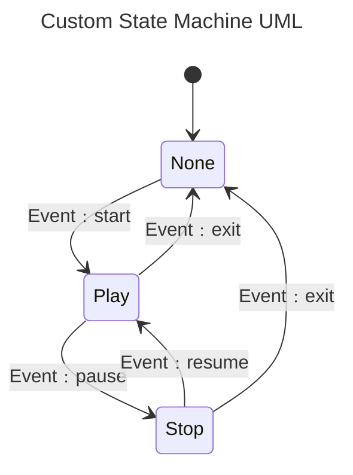
이러한 도표를 [UML State Diagrams](https://en.wikipedia.org/wiki/UML_state_machine)이라고 한다.  
&nbsp;  

일단 상태들을 enum으로 정의하자.  
```c++
enum class State
{
    None,
    Play,
    Stop
};
```
&nbsp;  

상태 전이를 발동시키는 동작(Event)들은 밑과 같다.  
```c++
enum class Event
{
    start,
    pause,
    resume,
    exit
};
```
&nbsp;  

map을 이용해 상태 관계를 정의해보자.  
```c++
class FSM
{
    std::map<State, std::vector<std::pair<Event, State>>> rules;
    State current_state;

  public:
    FSM(State init_state = State::None)
        : current_state{init_state}
    {
        rules[State::None] = {{Event::start, State::Play}};

        rules[State::Play] = {{Event::pause, State::Stop}, {Event::exit, State::None}};

        rules[State::Stop] = {{Event::resume, State::Play}, {Event::exit, State::None}};
    }
};
```
rules에 적절한 관계를 정의해 넣어두면 된다.  
None은 Play로, Play는 None, Stop으로, Stop은 Play, None으로 전이가 가능하다.  
현재 상태도 current_state에 저장해둬야 할 것이다.  
&nbsp;  

상태 전이 함수는 밑과 같다.  
```c++
class FSM
{
    // 동일 구현 생략
  public:
    bool trigger(Event evt)
    {
        // 출력 전용 map
        static std::map<State, std::string> ps{{State::None, "None"}, {State::Play, "Play"}, {State::Stop, "Stop"}};
        static std::map<Event, std::string> pe{{Event::exit, "exit"}, {Event::pause, "pause"}, {Event::resume, "resume"}, {Event::start, "start"}};

        for (int i = 0; i < rules[current_state].size(); i++)
            if (rules[current_state][i].first == evt)
            {
                // 상태 전이 성공 출력
                std::cout << "Source: " << ps[current_state] << ", Event: " << pe[evt] << ", Target: " << ps[rules[current_state][i].second] << "\n";

                // 현재 상태 변경
                current_state = rules[current_state][i].second;
                return true;
            }

        // 상태 전이 실패 출력
        std::cout << "Transition fail!\n";
        return false;
    }
}
```
현재 상태를 기반으로 주어진 이벤트에 해당하는 전이가 있는지 완전탐색을 해본다.  
&nbsp;  

활용은 밑과 같다.  
```c++
FSM fsm;
fsm.trigger(Event::start);
fsm.trigger(Event::pause);
fsm.trigger(Event::resume);
fsm.trigger(Event::exit);

// Fail!
fsm.trigger(Event::resume);
```
&nbsp;  

## Boost.MSM  

Boost의 [Meta State Machine(MSM)](https://www.boost.org/doc/libs/1_82_0/libs/msm/doc/HTML/index.html)은 상태를 표현하기 위해 유용한 [UML StateChart](https://en.wikipedia.org/wiki/UML_state_machine)를 코드에 적용하기 위해 탄생한 라이브러리이다.  
UML을 이용한 상태를 다루기에 간단한 상태부터 굉장히 복잡한 상태까지 모두 C++로 표현이 가능하다.  

MSM은 크게 [front-end](https://www.boost.org/doc/libs/1_82_0/libs/msm/doc/HTML/ch03s02.html)와 [back-end](https://www.boost.org/doc/libs/1_82_0/libs/msm/doc/HTML/ch03s05.html)로 나뉜다.  
front-end는 상태 구조체를 정의하는 부분이고 back-end는 구현된 상태 구조체를 실제로 사용하는 부분이다.  
front-end, back-end는 서로 맞물려 돌아가야 하기에 혼용해서 설명하겠다.  
&nbsp;  

### CD Player 예시  

아주 기초적인 MSM 예시를 보자.  
UML을 보기 전에 등장할 용어에 대해 알아야 한다.  
* Event  
    ```시작 상태``` ----> ```끝 상태```로 전이를 일으키는 이벤트를 뜻한다.  
    trigger 역할을 하기에 이벤트가 없으면 상태는 변하지 않는다.  
    **E**로 표시하겠다.  

* Guard  
    ```시작 상태``` ----> ```끝 상태```로 전이가 가능한지 불가능한지 Guard가 반환 하는 값을 통해 알 수 있다.  
    Guard가 false를 반환한다면 이벤트가 발생해도 ```시작 상태```에 머무른다.  
    true를 반환해야만 ```끝 상태```로 전이될 수 있다.  
    **G**로 표시하겠다.  

* Action  
    ```시작 상태``` ----> ```끝 상태```로 전이가 확정된 경우 발생하는 동작을 의미한다. (상태가 아니라 특정 동작이다.)   
    전이 중간에 수행되기에 ```시작 상태``` --- ```Action``` ---> ```끝 상태``` 이러한 순서라고 보면된다.  
    **A**로 표시하겠다.  

먼저 UML은 밑과 같이 생겼다.  
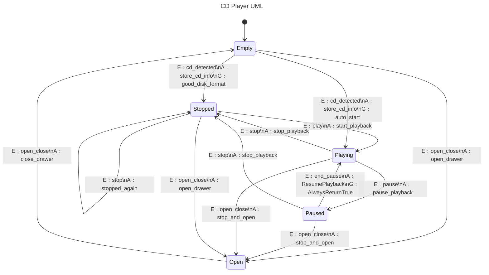
UML을 잘 보면 Empty에서 발생되는 cd_detected 이벤트로만 Playing, Stopped 두 개로 이어지는데 이러면 충돌이 날 수 있다.  
이러한 충돌을 방지하려고 auto_start라는 Guard가 false를 반환해 Empty에서 Playing으로 연결되는 trigger인 cd_detected 이벤트를 비활성화한다.  
&nbsp;  

위 UML 관계가 정의된 코드는 밑과 같다.  
```c++
// back-end header
#include <boost/msm/back/state_machine.hpp>

// front-end header
#include <boost/msm/front/state_machine_def.hpp>

// funtor row type header
#include <boost/msm/front/functor_row.hpp>

#pragma region 이벤트 정의
struct play
{
};

struct end_pause
{
};

struct stop
{
};

struct pause
{
};

struct open_close
{
};

// 좀 더 복잡한 이벤트들은 이벤트 객체에 특정 데이터가 같이 들어감.
enum DiskTypeEnum
{
    DISK_CD = 0,
    DISK_DVD = 1
};
struct cd_detected
{
    cd_detected(std::string name, DiskTypeEnum diskType)
        : name(name),
          disc_type(diskType)
    {
    }

    std::string name;
    DiskTypeEnum disc_type;
};
#pragma endregion

// front-end: Finite State Machine(FSM)이 정의된 player_ 객체
// boost::msm::front::state_machine_def<자기 자신>를 상속하여 지정할 수 있다.
struct player_ : public boost::msm::front::state_machine_def<player_>
{
    // FSM 객체를 start() 함수로 호출하면 on_entry() 함수가 작동
    template <class Event, class FSM>
    void on_entry(Event const &, FSM &)
    {
        std::cout << "entering: Player" << std::endl;
    }

    // FSM 객체를 stop() 함수로 호출하면 on_exit() 함수가 작동
    template <class Event, class FSM>
    void on_exit(Event const &, FSM &)
    {
        std::cout << "leaving: Player" << std::endl;
    }

#pragma region FSM 객체에서 사용하는 상태 정의
    // Empty 상태
    // 모든 상태는 boost::msm::front::state<>를 상속해야 한다.
    struct Empty : public boost::msm::front::state<>
    {
        // 상태에 진입하면 on_entry() 함수가 호출됨
        // 인자의 의미는 밑과 같음
        // Event => play, end_pause와 같은 이벤트 객체, 자신의 on_entry() 함수를 호출한 이벤트가 위치한다.  
        // FSM => 해당 상태를 호출한 FSM 객체, 여기선 player_
        template <class Event, class FSM>
        void on_entry(Event const &, FSM &)
        {
            std::cout << "entering: Empty" << std::endl;
        }

        // 상태에서 빠져나가면 on_exit() 함수가 호출됨
        template <class Event, class FSM>
        void on_exit(Event const &, FSM &)
        {
            std::cout << "leaving: Empty" << std::endl;
        }
    };

    // Open 상태
    struct Open : public boost::msm::front::state<>
    {
        template <class Event, class FSM>
        void on_entry(Event const &, FSM &)
        {
            std::cout << "entering: Open" << std::endl;
        }
        template <class Event, class FSM>
        void on_exit(Event const &, FSM &)
        {
            std::cout << "leaving: Open" << std::endl;
        }
    };

    // Stop 상태
    struct Stopped : public boost::msm::front::state<>
    {
        template <class Event, class FSM>
        void on_entry(Event const &, FSM &)
        {
            std::cout << "entering: Stopped" << std::endl;
        }
        template <class Event, class FSM>
        void on_exit(Event const &, FSM &)
        {
            std::cout << "leaving: Stopped" << std::endl;
        }
    };

    // Playing 상태
    struct Playing : public boost::msm::front::state<>
    {
        template <class Event, class FSM>
        void on_entry(Event const &, FSM &)
        {
            std::cout << "entering: Playing" << std::endl;
        }
        template <class Event, class FSM>
        void on_exit(Event const &, FSM &)
        {
            std::cout << "leaving: Playing" << std::endl;
        }
    };

    // Paused 상태
    // on_entry(), on_exit()를 필수로 구현할 필요는 없다.
    struct Paused : public boost::msm::front::state<>
    {
    };
#pragma endregion

    // FSM이 start() 함수로 시작되고 어느 상태에 놓이는지 결정함.
    // initial_state를 특정 상태 자료형으로 정의해주면 됨.
    // 즉 player_는 생성되면 Empty 상태에 놓임.
    using initial_state = Empty;

    // 밑과 같이 시작 이벤트를 play로 지정할 수도 있다.  
    // using initial_event = play;

#pragma region Action Callable 정의
    // 밑에 정의된 Callable들은 Action으로 [시작 상태] ---> [끝 상태] 이렇게 변할 때 그 사이에서 수행되는 동작이라고 보면 된다.
    // 즉 [시작 상태]가 [끝 상태]로 도달하는 것이 확정되면 Action은 [끝 상태] 도달 전에 발생하고 그 후에 현재 상태는 [끝 상태]에 도달한다.
    void start_playback(play const &)
    {
        std::cout << "player::start_playback\n";
    }
    void open_drawer(open_close const &)
    {
        std::cout << "player::open_drawer\n";
    }
    void close_drawer(open_close const &)
    {
        std::cout << "player::close_drawer\n";
    }
    void store_cd_info(cd_detected const &)
    {
        std::cout << "player::store_cd_info\n";
    }
    void stop_playback(stop const &)
    {
        std::cout << "player::stop_playback\n";
    }
    void pause_playback(pause const &)
    {
        std::cout << "player::pause_playback\n";
    }
    void stop_and_open(open_close const &)
    {
        std::cout << "player::stop_and_open\n";
    }
    void stopped_again(stop const &)
    {
        std::cout << "player::stopped_again\n";
    }

    // 이렇게 Funtor를 정의해서 사용할 수도 있다.
    // 각 operator() 인자의 의미는 다음과 같다.
    // Evt -> 해당 Action과 관련된 이벤트
    // Fsm -> ResumePlayback를 호출한 FSM 객체
    // SourceState -> 시작 상태 객체
    // TargetState -> 끝 상태 객체
    struct ResumePlayback
    {
        template <class Fsm, class Evt, class SourceState, class TargetState>
        void operator()(Evt const &, Fsm &fsm, SourceState &src, TargetState &)
        {
            std::cout << "player::resume_playback\n";
        }
    };
#pragma endregion

#pragma region Guard Callable 정의
    // Guard Callable은 특정 상태가 다른 상태로 이동할 수 있는지 조건을 검사하는 곳에 이용되는 Callable이다.
    // Callable의 반환형은 bool 자료형이여야 하며 Guard Callable의 인자는 상태 전이 시 사용된 이벤트 객체여야 한다.

    // good_disk_format() 함수는 cd_detected 이벤트에 DISK_CD가 담겨져서 전달되지 않으면 다음 상태로 이동하는 것을 막는 역할을 한다.
    bool good_disk_format(cd_detected const &evt)
    {
        if (evt.disc_type != DISK_CD)
        {
            std::cout << "wrong disk, sorry" << std::endl;
            return false;
        }
        return true;
    }
    // 이벤트가 동일해 충돌이 발생하는 경우 Guard Callable에서 false를 반환하여 이를 방지할 수 있다.
    bool auto_start(cd_detected const &)
    {
        return false;
    }

    // Guard Callable도 Action Callable과 마찬가지로 Funtor를 이용할 수 있다.
    struct AlwaysReturnTrue
    {
        template <class EVT, class FSM, class SourceState, class TargetState>
        bool operator()(EVT const &, FSM &fsm, SourceState &, TargetState &)
        {
            return true;
        }
    };
#pragma endregion

#pragma region 상태 전이 테이블 정의
    // 상태와 상태를 연결하는 방식은 밑과 같이 boost::mpl::vector의 템플릿 인자로 넘겨 이루어진다.
    // 템플릿 인자로 넘기는 방식은 두 가지가 존재한다.
    // 1. Basic 방식
    // Basic 방식에서는 함수를 이용하며 row, a_row, g_row, _row 이렇게 4가지를 활용할 수 있다.
    // 1-1. _row (액션와 가드 모두 없음)
    // Stopped 상태에서 play 이벤트가 발생할 때 Open 상태로 변경되는 관계 => _row<Stopped, play, Open>
    //
    // 1-2. a_row (액션만 있음)
    // Stopped 상태에서 play 이벤트가 발생할 때 Open 상태로 변경되는 관계, 변경 시에 player_::open 함수가 수행됨 => a_row<Stopped, play, Open, &player_::open>
    //
    // 1-3. g_row (가드만 있음)
    // Stopped 상태에서 play 이벤트가 발생할 때 Open 상태로 변경되는 관계, 상태 전이가 가능한지 검사하는 player_::can_open 함수가 존재함 => g_row<Stopped, play, Open, &player_::can_open>
    //
    // 1-4. row (액션, 가드 모두 있음)
    // Stopped 상태에서 play 이벤트가 발생할 때 Open 상태로 변경되는 관계, 상태 전이가 가능한지 검사하는 player_::can_open 함수가 존재함, 변경 시에 player_::open 함수가 수행됨 => g_row<Stopped, play, Open, &player_::open, &player_::can_open>
    //
    // 2. Funtor 방식
    // Funtor 방식에서는 이름 그대로 함수가 아니고 Funtor를 이용하며 boost::msm::front::Row만 존재한다.
    // Boost에서는 Funtor 방식을 추천한다.
    // Row의 인자 순서는 Row<시작 상태, 이벤트, 끝 상태, 액션 Funtor, 가드 Funtor> 와 같다.
    // 만약 인자 중 하나라도 빠져야 한다면 boost::msm::front::none을 이용하면 된다.
    // Stopped 상태에서 play 이벤트가 발생할 때 Open 상태로 변경되는 관계 => Row<Stopped, play, Open, boost::msm::front::none, boost::msm::front::none>

    struct transition_table : boost::mpl::vector<
                                  a_row<Stopped, play, Playing, &player_::start_playback>,
                                  a_row<Stopped, open_close, Open, &player_::open_drawer>,
                                  _row<Stopped, stop, Stopped>,
                                  a_row<Open, open_close, Empty, &player_::close_drawer>,
                                  a_row<Empty, open_close, Open, &player_::open_drawer>,
                                  row<Empty, cd_detected, Stopped, &player_::store_cd_info, &player_::good_disk_format>,
                                  row<Empty, cd_detected, Playing, &player_::store_cd_info, &player_::auto_start>,
                                  a_row<Playing, stop, Stopped, &player_::stop_playback>,
                                  a_row<Playing, pause, Paused, &player_::pause_playback>,
                                  a_row<Playing, open_close, Open, &player_::stop_and_open>,
                                  boost::msm::front::Row<Paused, end_pause, Playing, ResumePlayback, AlwaysReturnTrue>,
                                  a_row<Paused, stop, Stopped, &player_::stop_playback>,
                                  a_row<Paused, open_close, Open, &player_::stop_and_open>>
    {
    };
#pragma endregion

    // 정의되지 않은 상태 전이는 밑 함수가 받게 된다.
    // 인자 중 state는 상태에게 할당된 인덱스를 의미한다.
    // 해당 상태 인덱스 규칙은 pstate() 함수를 설명한 주석에서 다룬다.
    template <class FSM, class Event>
    void no_transition(Event const &e, FSM &, int state)
    {
        std::cout << "no transition from state " << state
                  << " on event " << typeid(e).name() << std::endl;
    }
};

// FSM을 사용하려면 boost::msm::back::state_machine<FSM 객체>를 이용해야 한다.
// 이름이 길어지니 using, typedef 등을 이용해 줄여서 쓰는 것이 대부분이다.
using player = boost::msm::back::state_machine<player_>;

// 현재 상태 출력
// current_state()를 이용해 현재 상태의 배열을 얻는다.
// 여기서 배열을 얻는다는 말이 이상하게 들릴 수 있는데 이는 FSM의 영역이 동시에 여러개 존재할 수 있기 때문이다.
// 직교 영역(Orthogonal regions)을 설명할 때 좀 더 자세히 다룰 것이다.
// 일단 현재 다루고 있는 player라는 FMS의 영역은 하나이니 current_state()의 첫번째 값만 확인하면 된다.
// 따라서 current_state()[0]를 통해 현재 상태를 확인할 수 있다.
// 인덱스가 정해지는 규칙은 간단한데 다음 예시를 보면 이해가 쉽다.
//
// Row<One, some_event, Two>
// Row<Two, some_event, SomeState>
// Row<Three, some_event, Five>
// Row<Four, some_event, Two>
//
// 위와 같은 관계가 정의되어 있을 때 인덱스는 밑과 같이 정해진다.
// One : 0, Two: 1, Three: 2, Four: 3, SomeState: 4, Five : 5
// [시작 상태] 위에서 아래로 번호가 매겨진다.
// [시작 상태] 목록 끝을 만났다면 다시 [끝 상태] 목록의 상단으로 이동해서 아래로 내려가면서 번호가 매겨진다.
static char const *const state_names[] = {"Stopped", "Open", "Empty", "Playing", "Paused"};
void pstate(player const &p)
{
    std::cout << " -> " << state_names[p.current_state()[0]] << std::endl;
}

int main()
{
    player p;

    // FSM 객체의 on_entry()를 작동시키기 위해 start() 함수 호출
    // 초기 상태가 Empty이기에 Empty의 on_entry()도 작동한다.
    p.start();

    // 이벤트 호출은 process_event() 함수로 가능하다.  
    // 현재 Empty 상태에서 Open 상태로 이동
    // Empty의 on_exit()가 작동하고 그 후 Open의 on_entry()가 작동함.
    p.process_event(open_close());
    pstate(p);

    p.process_event(open_close());
    pstate(p);

    // DISK_DVD가 전달된 이벤트는 Guard Callble에 의해 무시된다.
    p.process_event(cd_detected("louie, louie", DISK_DVD));
    pstate(p);

    p.process_event(cd_detected("louie, louie", DISK_CD));
    pstate(p);

    p.process_event(play());
    p.process_event(pause());
    pstate(p);

    // go back to Playing
    p.process_event(end_pause());
    pstate(p);

    p.process_event(pause());
    pstate(p);

    // Stopped 상태로 이동
    p.process_event(stop());
    pstate(p);

    // Stopped 상태에서 stop 이벤트가 발생해도 다시 Stopped 상태다.
    p.process_event(stop());
    pstate(p);
    std::cout << "stop fsm" << std::endl;

    // FSM 종료시 stop() 함수 호출하여 FSM의 on_exit() 함수 수행.
    p.stop();

    return 0;
}
```
코드가 굉장히 많지만 주석을 읽어보면 어떤 일을 하는지 알 수 있다.  
모든 no_transition(), on_entry(), on_exit() 함수는 생략이 가능하다.  
&nbsp;  

상태의 개수가 10개가 넘어가면 밑과 같이 매크로를 수정해줘야 한다.  
```c++
#define FUSION_MAX_VECTOR_SIZE 20 // 기본 값은 10
```
헤더가 선언되기 전에 추가해야 한다.  
&nbsp;  

상태 테이블에 정의된 관계 개수의 제한은 20이기에 매크로를 수정해줘야 한다.  
```c++
#define BOOST_MPL_CFG_NO_PREPROCESSED_HEADERS
#define BOOST_MPL_LIMIT_VECTOR_SIZE 30 // 기본 값은 20
#define BOOST_MPL_LIMIT_MAP_SIZE 30 // 기본 값은 20 
```
주의할 점은 50개를 초과하여 매크로를 수정할 수는 없다.  
당연히 이 녀석도 헤더가 선언되기 전에 추가해야 한다.  

상태 테이블에 50개가 넘어가는 관계를 정의해야 한다면 Boost의 mp11 라이브러리를 사용해야 한다.  
mp11의 mp_list는 템플릿 인자 개수에 제한이 없다.  
```c++
// 최대 50개까지 관계 설정 가능
struct transition_table : boost::mpl::vector<boost::msm::front::Row<SourceState, Event, TargetState>>
{
};

// 관계 설정 개수 무제한
using transition_table = boost::mp11::mp_list<boost::msm::front::Row<SourceState, Event, TargetState>>;
```
mp_list를 사용하는 방식이 비교적 최신이다.  
&nbsp;  

#### Deffered State  

만약 위의 FSM의 Empty 상태에서 pause 이벤트가 발생한다면 어떻게 될까?  
처리할 수 있는 상태 전이가 없어서 no_transition() 함수가 수행될 것이다.  

하지만 상태 이벤트의 지연 처리가 필요할 때가 있다.  
Empty 상태에서 pause 이벤트가 발생해도 no_transition() 함수가 수행되며 이벤트가 기각되지 않고 이벤트 큐에 저장했다가 FSM의 상태가 pause 이벤트를 처리할 수 있을 때 그 이벤트를 처리하는 Deffered State 기능을 Boost MSM은 제공한다.  

[CD Player 코드](#cd-player-예시)에서 상태를 살짝 바꿔보자.  
```c++
struct Empty : public boost::msm::front::state<>
{
    // play 이벤트가 Empty 상태에 도착해도 처리하지 않고 이벤트 큐에 저장만 해둠
    using deferred_events = mpl::vector<play, stop>;

    template <class Event, class FSM>
    void on_entry(Event const &, FSM &)
    {
        std::cout << "entering: Empty" << std::endl;
    }
    template <class Event, class FSM>
    void on_exit(Event const &, FSM &)
    {
        std::cout << "leaving: Empty" << std::endl;
    }
};
```
deferred_events가 정의되면 Empty 상태에서 play, stop 이벤트가 도착해도 이벤트 큐에 추가할 뿐 처리하지 않는다.  
상황을 보면 이해가 쉽다.  
``` 
Empty --> play [아무 반응 없음, 이벤트 큐에 play 추가]
Empty --> cd_detected [바로 처리됨] --> Stopped
Stopped --> play [이벤트 큐에 있던 이벤트를 이 시점에 처리] --> Playing
```
Stopped에 도착을 하면 이벤트 큐에 들어있는 잔여 이벤트를 수행하기에 자동으로 Playing 상태로 넘어간다.  
&nbsp;  

문제는 아래와 같은 상태이다.  
```
Empty --> play [아무 반응 없음, 이벤트 큐에 play 추가]
Empty --> open_close [바로 처리됨] --> Open
Open --> play [이벤트 큐에 있던 이벤트를 이 시점에 처리] --> [no_transition() 함수 호출]
```
위와 같은 상황을 방지하려면 Open 상태 구조체에도 deferred_events를 추가해줘야 한다.  
&nbsp;  

이렇게 일일이 deferred_events를 각 상태마다 적어주기 귀찮다면 activate_deferred_events 기능을 이용하면 된다.  
해당 기능은 FSM에 직접 입력한다.  
```c++
struct player_ : public boost::msm::front::state_machine_def<player_>
{
    using activate_deferred_events = int;

    // 구현부 생략
};
```
activate_deferred_events가 위와 같이 정의되면 player_ FSM에 존재하는 모든 상태는 처리할 수 없는 이벤트가 도착하면 no_transition() 함수를 실행하지 않고 이벤트 큐에 넣어버린다.  
&nbsp;  

### SubState  

특정 상태 내부에 또 다른 자식 상태(SubState)들이 존재할 수 있다.  
예를 들어 아픈 상태라면 감기, 독감, 골절 등 내부적으로 상태가 또 나뉠 수가 있다.  

CD Player 예시를 SubState가 있는 예시로 바꿔보자.  
Guard는 모두 PrintState이기에 생략한다.  
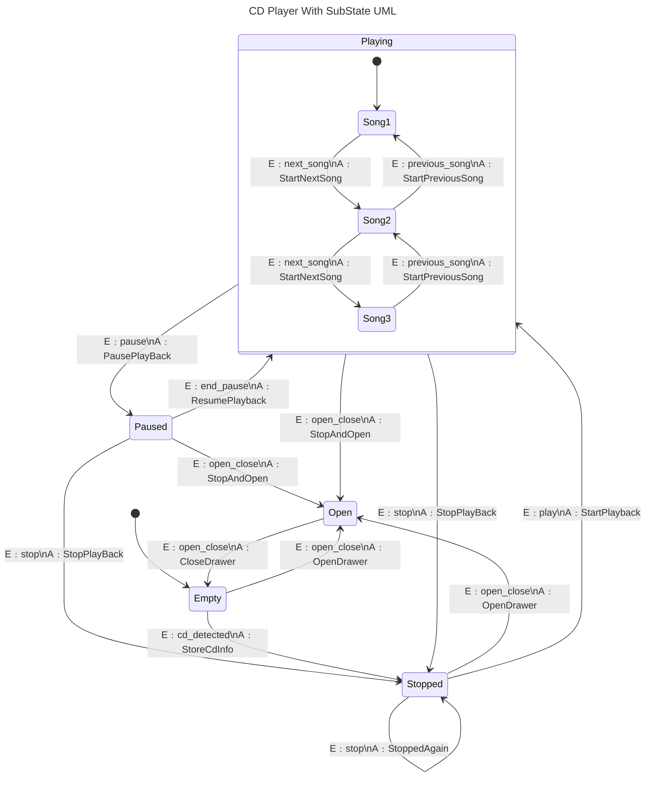
CD Player는 Playing 상태 내부에 다양한 SubState가 추가되어 이제 음악을 넘기면서 들을 수가 있다.  
&nbsp;  

위 UML을 코드에 적용하면 밑과 같다.  
```c++
// back-end header
#include <boost/msm/back/state_machine.hpp>

// front-end header
#include <boost/msm/front/state_machine_def.hpp>

// funtor row type header
#include <boost/msm/front/functor_row.hpp>

namespace msm = boost::msm;
namespace mpl = boost::mpl;

// MainState에 사용될 이벤트
struct play
{
};
struct end_pause
{
};
struct stop
{
};
struct pause
{
};
struct open_close
{
};
struct cd_detected
{
    cd_detected(std::string name)
        : name(name)
    {
    }

    std::string name;
};

// SubState에 사용될 이벤트
struct next_song
{
};
struct previous_song
{
};

// 상태 출력용 Guard
struct PrintState
{
    template <class Fsm, class Evt, class SourceState, class TargetState>
    bool operator()(Evt const &event, Fsm &fsm, SourceState &src, TargetState &trg)
    {
        std::cout << "Current State Index: " << fsm.current_state()[0] << "\n";
        std::cout << "Source: " << typeid(src).name() << " --- "
                  << "Event: " << typeid(event).name() << " ---> "
                  << "Target: " << typeid(trg).name() << "\n";
        return true;
    }
};

struct player_ : public msm::front::state_machine_def<player_>
{
    template <class Event, class FSM>
    void on_entry(Event const &, FSM &)
    {
        std::cout << "entering: Player" << std::endl;
    }
    template <class Event, class FSM>
    void on_exit(Event const &, FSM &)
    {
        std::cout << "leaving: Player" << std::endl;
    }

    struct Empty : public msm::front::state<>
    {
        template <class Event, class FSM>
        void on_entry(Event const &, FSM &)
        {
            std::cout << "entering: Empty" << std::endl;
        }
        template <class Event, class FSM>
        void on_exit(Event const &, FSM &)
        {
            std::cout << "leaving: Empty" << std::endl;
        }
    };
    struct Open : public msm::front::state<>
    {
        template <class Event, class FSM>
        void on_entry(Event const &, FSM &)
        {
            std::cout << "entering: Open" << std::endl;
        }
        template <class Event, class FSM>
        void on_exit(Event const &, FSM &)
        {
            std::cout << "leaving: Open" << std::endl;
        }
    };
    struct Stopped : public msm::front::state<>
    {
        template <class Event, class FSM>
        void on_entry(Event const &, FSM &)
        {
            std::cout << "entering: Stopped" << std::endl;
        }
        template <class Event, class FSM>
        void on_exit(Event const &, FSM &)
        {
            std::cout << "leaving: Stopped" << std::endl;
        }
    };

    // SubState를 포함하는 Playing 상태를 정의한다.
    // FSM을 정의할 때와 같이 msm::front::state_machine_def<자기 자신>를 상속하면 된다.
    // Playing 내부에 상태를 정의하는 경우에도 FSM에 상태를 정의하는 것과 별반 다르지 않다.
    // 참고로 Playing_ 객체는 player_ 외부에 정의해도 작동한다.
    // 이 예시에서는 편의를 위해 안에다 정의했다.
    struct Playing_ : public msm::front::state_machine_def<Playing_>
    {
        // Playing 상태 진입시 on_entry() 함수 수행
        template <class Event, class FSM>
        void on_entry(Event const &, FSM &)
        {
            std::cout << "entering: Playing" << std::endl;
        }

        // Playing 상태 탈출시 on_exit() 함수 수행
        template <class Event, class FSM>
        void on_exit(Event const &, FSM &)
        {
            std::cout << "leaving: Playing" << std::endl;
        }

        // SubState들 정의
        struct Song1 : public msm::front::state<>
        {
            template <class Event, class FSM>
            void on_entry(Event const &, FSM &)
            {
                std::cout << "starting: First song" << std::endl;
            }
            template <class Event, class FSM>
            void on_exit(Event const &, FSM &)
            {
                std::cout << "finishing: First Song" << std::endl;
            }
        };
        struct Song2 : public msm::front::state<>
        {
            template <class Event, class FSM>
            void on_entry(Event const &, FSM &)
            {
                std::cout << "starting: Second song" << std::endl;
            }
            template <class Event, class FSM>
            void on_exit(Event const &, FSM &)
            {
                std::cout << "finishing: Second Song" << std::endl;
            }
        };
        struct Song3 : public msm::front::state<>
        {
            template <class Event, class FSM>
            void on_entry(Event const &, FSM &)
            {
                std::cout << "starting: Third song" << std::endl;
            }
            template <class Event, class FSM>
            void on_exit(Event const &, FSM &)
            {
                std::cout << "finishing: Third Song" << std::endl;
            }
        };

        // SubState를 품고 있는 Playing 상태는 당연히 initial_state를 지정해줘야 한다.
        using initial_state = Song1;

        struct StartNextSong
        {
            template <class Fsm, class Evt, class SourceState, class TargetState>
            void operator()(Evt const &, Fsm &fsm, SourceState &src, TargetState &)
            {
                std::cout << "Playing::start_next_song\n";
            }
        };
        struct StartPreviousSong
        {
            template <class Fsm, class Evt, class SourceState, class TargetState>
            void operator()(Evt const &, Fsm &fsm, SourceState &src, TargetState &)
            {
                std::cout << "Playing::start_prev_song\n";
            }
        };

        // Transition table for Playing
        struct transition_table : mpl::vector<
                                      //      Start     Event         Next      Action               Guard
                                      //    +---------+-------------+---------+---------------------+----------------------+
                                      msm::front::Row<Song1, next_song, Song2, StartNextSong, PrintState>,
                                      msm::front::Row<Song2, previous_song, Song1, StartPreviousSong, PrintState>,
                                      msm::front::Row<Song2, next_song, Song3, StartNextSong, PrintState>,
                                      msm::front::Row<Song3, previous_song, Song2, StartPreviousSong, PrintState>
                                      //    +---------+-------------+---------+---------------------+----------------------+
                                      >
        {
        };

        // 이벤트를 처리하지 못하는 상황에 수행되는 no_transition() 함수 정의
        template <class FSM, class Event>
        void no_transition(Event const &e, FSM &, int state)
        {
            std::cout << "no transition from state " << state
                      << " on event " << typeid(e).name() << std::endl;
        }
    };

    // SubState를 담고 있는 상태는 반드시 msm::back::state_machine로 감싼 녀석을 이용해야 한다.  
    // msm::back::state_machine<Playing_>를 상태로 사용하기 번거로우므로 Playing으로 줄인다.  
    using Playing = msm::back::state_machine<Playing_>;

    struct Paused : public msm::front::state<>
    {
    };

    // 기본 FSM도 당연히 initial_state를 지정해준다.
    using initial_state = Empty;

    // Action 정의
    struct StartPlayback
    {
        template <class Fsm, class Evt, class SourceState, class TargetState>
        void operator()(Evt const &, Fsm &fsm, SourceState &src, TargetState &)
        {
            std::cout << "player::StartPlayback\n";
        }
    };
    struct OpenDrawer
    {
        template <class Fsm, class Evt, class SourceState, class TargetState>
        void operator()(Evt const &, Fsm &fsm, SourceState &src, TargetState &)
        {
            std::cout << "player::OpenDrawer\n";
        }
    };
    struct CloseDrawer
    {
        template <class Fsm, class Evt, class SourceState, class TargetState>
        void operator()(Evt const &, Fsm &fsm, SourceState &src, TargetState &)
        {
            std::cout << "player::CloseDrawer\n";
        }
    };
    struct StoreCdInfo
    {
        template <class Fsm, class Evt, class SourceState, class TargetState>
        void operator()(Evt const &, Fsm &fsm, SourceState &src, TargetState &)
        {
            std::cout << "player::StoreCdInfo\n";
        }
    };
    struct StopPlayBack
    {
        template <class Fsm, class Evt, class SourceState, class TargetState>
        void operator()(Evt const &, Fsm &fsm, SourceState &src, TargetState &)
        {
            std::cout << "player::StopPlayBack\n";
        }
    };
    struct PausePlayBack
    {
        template <class Fsm, class Evt, class SourceState, class TargetState>
        void operator()(Evt const &, Fsm &fsm, SourceState &src, TargetState &)
        {
            std::cout << "player::PausePlayBack\n";
        }
    };
    struct ResumePlayBack
    {
        template <class Fsm, class Evt, class SourceState, class TargetState>
        void operator()(Evt const &, Fsm &fsm, SourceState &src, TargetState &)
        {
            std::cout << "player::ResumePlayBack\n";
        }
    };
    struct StopAndOpen
    {
        template <class Fsm, class Evt, class SourceState, class TargetState>
        void operator()(Evt const &, Fsm &fsm, SourceState &src, TargetState &)
        {
            std::cout << "player::StopAndOpen\n";
        }
    };
    struct StoppedAgain
    {
        template <class Fsm, class Evt, class SourceState, class TargetState>
        void operator()(Evt const &, Fsm &fsm, SourceState &src, TargetState &)
        {
            std::cout << "player::StoppedAgain\n";
        }
    };

    // 상태 관계 정의 테이블
    struct transition_table : mpl::vector<
                                  msm::front::Row<Stopped, play, Playing, StartPlayback, PrintState>,
                                  msm::front::Row<Stopped, open_close, Open, OpenDrawer, PrintState>,
                                  msm::front::Row<Stopped, stop, Stopped, StoppedAgain, PrintState>,
                                  msm::front::Row<Open, open_close, Empty, CloseDrawer, PrintState>,
                                  msm::front::Row<Empty, open_close, Open, OpenDrawer, PrintState>,
                                  msm::front::Row<Empty, cd_detected, Stopped, StoreCdInfo, PrintState>,
                                  msm::front::Row<Playing, stop, Stopped, StopPlayBack, PrintState>,
                                  msm::front::Row<Playing, pause, Paused, PausePlayBack, PrintState>,
                                  msm::front::Row<Playing, open_close, Open, StopAndOpen, PrintState>,
                                  msm::front::Row<Paused, end_pause, Playing, ResumePlayBack, PrintState>,
                                  msm::front::Row<Paused, stop, Stopped, StopPlayBack, PrintState>,
                                  msm::front::Row<Paused, open_close, Open, StopAndOpen, PrintState>>
    {
    };

    template <class FSM, class Event>
    void no_transition(Event const &e, FSM &, int state)
    {
        std::cout << "no transition from state " << state
                  << " on event " << typeid(e).name() << std::endl;
    }
};

using player = msm::back::state_machine<player_>;

int main()
{
    player p;

    p.start();

    p.process_event(open_close());

    p.process_event(open_close());

    p.process_event(cd_detected("louie, louie"));

    p.process_event(play());

    // 현재 Playing 상태에 도달했다.
    // 바로 pause 이벤트로 탈출할 수도 있지만 SubState를 실행해보자.
    // Playing을 진입하면서 첫 번째 곡이 활성화된다.
    p.process_event(next_song());

    // 두 번째 곡이 활성화
    p.process_event(next_song());

    // 세 번째 곡이 활성화
    p.process_event(previous_song());

    // 두 번째 곡이 활성화되어 있는 상태에서 pause 이벤트로 Playing 상태 탈출
    p.process_event(pause());

    // 현재 pause 상태
    p.process_event(end_pause());

    p.process_event(pause());

    p.process_event(stop());

    p.process_event(stop());

    p.process_event(play());

    // FSM 종료
    std::cout << "stop fsm" << std::endl;
    p.stop();

    // 밑과 같이 재시작도 가능하다.
    std::cout << "restart fsm" << std::endl;
    p.start();

    return 0;
}
```
SubState를 담고 있는 상태도 내부 FSM이기에 크게 다르지 않다.  
중요한 것은 ```using Playing = msm::back::state_machine<Playing_>;``` 해당 부분이다.  
SubState를 포함한 상태는 msm::back::state_machine로 감싸서 이용해야 작동한다.  
&nbsp;  

#### History  

SubState를 이용할 때 불편한 점이 있다.  
SubState를 담고 있는 상태를 빠져나갔다가 다시 해당 상태로 돌아오면 어디 SubState까지 진행했었는지 기억을 못한다.  
```
Playing --> Song1 --> Song2 -- [pause 이벤트 발생] --> Paused
[end_pause 이벤트 발생] --> Playing -- [Playing은 과거에 어떤 SubState까지 진행했는지 기억을 못함] --> Song1 
```
Song2를 재생하다가 멈추고 다시 재생해도 Playing 상태가 초기화되어 Song1이 재생되어 버린다.  
&nbsp;  

이러한 문제점을 해결하기 위해 Boost MSM은 History라는 기능을 제공한다.  
History를 이용하면 SubState를 담고 있는 상태가 초기화되지 않고 어디까지 진행했었는지 기억하고 있다.  
[SubState 예시](#substate) 코드를 수정해보자.  
```c++
// 동일한 구현부 생략 

struct player_ : public msm::front::state_machine_def<player_>
{
    // 동일한 구현부 생략 

    using Playing = msm::back::state_machine<Playing_, msm::back::ShallowHistory<mpl::vector<end_pause>>>;
};
```
바뀐 것은 SubState를 담고 있는 상태인 Playing 자료형의 선언부 밖에 없다.  
```msm::back::ShallowHistory<mpl::vector<end_pause>>``` 이 부분만 추가해주면 end_pause 이벤트를 통해 Playing 상태를 재진입할 때 예전에 수행되던 SubState부터 시작된다.  

모든 이벤트에 대해서 History 기능을 수행하고 싶다면 밑과 같이 사용하면 된다.  
```c++
// 동일한 구현부 생략 

struct player_ : public msm::front::state_machine_def<player_>
{
    // 동일한 구현부 생략 

    using Playing = msm::back::state_machine<Playing_, msm::back::AlwaysHistory>;
};
```
특정 이벤트로 재진입한 경우 History 기능을 이용하고 싶다면 ShallowHistory를, 모든 이벤트에 대해 History 기능을 이용하고 싶다면 AlwaysHistory를 사용하면 된다.  
&nbsp;  

### Orthogonal regions  

Caps Lock과 Insert 키가 눌릴 때의 상태는 서로에게 영향을 주지 않는다.  
따라서 이러한 경우 이 둘의 조합을 따져야 한다.  
```None```, ```Caps Lock```, ```Insert```, ```Caps Lock + Insert``` 이렇게 4개의 상태가 존재한다.  

지금까지 배운 정보로 UML을 만들어 본다면 밑과 같다.  
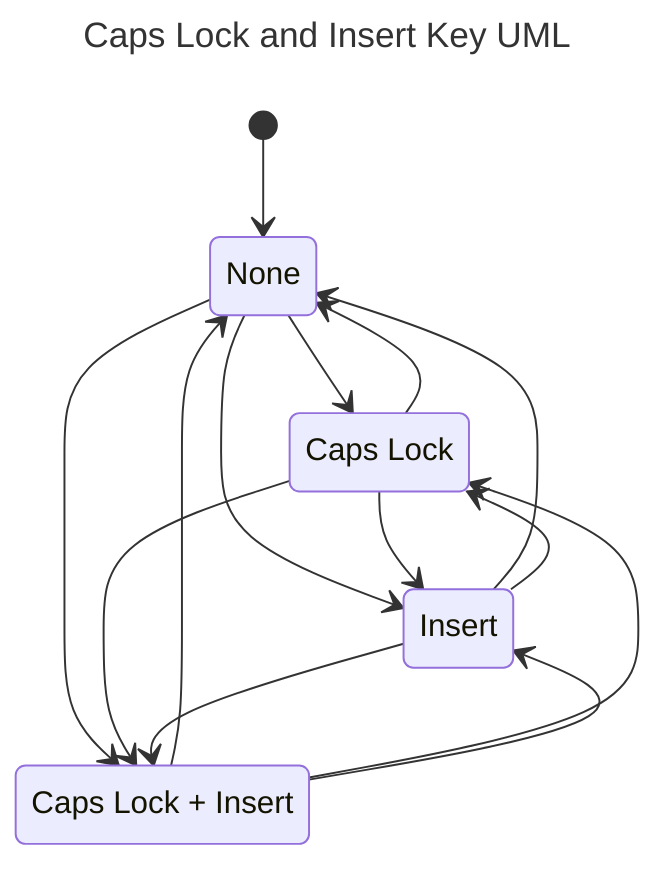
4개의 상태를 표현할 뿐인데 12개의 이벤트가 필요하다.  
&nbsp;  

하지만 동시 상태 영역(Orthogonal Zone)을 이용하면 깔끔해진다.  
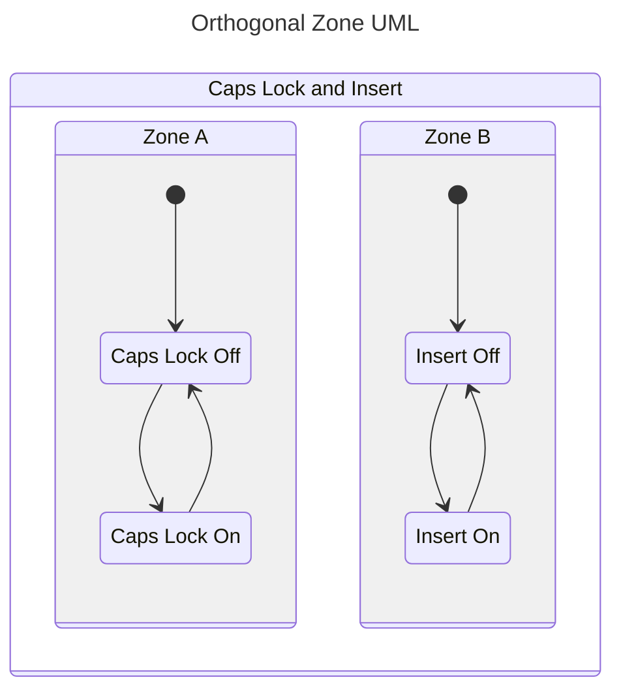
FSM이 동시 상태를 가질 수 있기에 4개의 이벤트로 서로 다른 4개의 상태를 표현할 수 있다.  
&nbsp;  

위 UML을 코드에 적용해보자.  
```c++
// back-end header
#include <boost/msm/back/state_machine.hpp>

// front-end header
#include <boost/msm/front/state_machine_def.hpp>

// funtor row type header
#include <boost/msm/front/functor_row.hpp>

namespace msm = boost::msm;
namespace mpl = boost::mpl;

// 이벤트 정의
struct caps_lock_on
{
};
struct caps_lock_off
{
};
struct insert_on
{
};
struct insert_off
{
};

// 상태 출력용 Guard
struct PrintState
{
    template <class Fsm, class Evt, class SourceState, class TargetState>
    bool operator()(Evt const &event, Fsm &fsm, SourceState &src, TargetState &trg)
    {
        for (size_t i = 0; i < Fsm::nr_regions::value; i++)
            std::cout << "Zone " << i << " State Index: " << fsm.current_state()[i] << "\n";

        std::cout << "Source: " << typeid(src).name() << " --- "
                  << "Event: " << typeid(event).name() << " ---> "
                  << "Target: " << typeid(trg).name() << "\n";
        return true;
    }
};

struct KeyBoardFsm : public msm::front::state_machine_def<KeyBoardFsm>
{
    // 상태 정의
    struct CapsLockOff : public msm::front::state<>
    {
    };
    struct CapsLockOn : public msm::front::state<>
    {
    };
    struct InsertOff : public msm::front::state<>
    {
    };
    struct InsertOn : public msm::front::state<>
    {
    };

    // Guard 정의

    // Orthogonal Zone 시작 상태 정의
    using initial_state = mpl::vector<CapsLockOff, InsertOff>;

    struct transition_table : mpl::vector<
                                  msm::front::Row<CapsLockOff, caps_lock_on, CapsLockOn, msm::front::none, PrintState>,
                                  msm::front::Row<CapsLockOn, caps_lock_off, CapsLockOff, msm::front::none, PrintState>,
                                  msm::front::Row<InsertOff, insert_on, InsertOn, msm::front::none, PrintState>,
                                  msm::front::Row<InsertOn, insert_off, InsertOff, msm::front::none, PrintState>>
    {
    };
};

using KeyBoardState = msm::back::state_machine<KeyBoardFsm>;

int main()
{
    KeyBoardState ks;

    ks.start();

    ks.process_event(caps_lock_on()); // Caps Lock

    ks.process_event(insert_on()); // Caps Lock + Insert

    ks.process_event(caps_lock_off()); // Insert

    ks.process_event(insert_off()); // None

    ks.stop();

    return 0;
}
```
initial_state의 선언부가 달라졌다.  
```mpl::vector<CapsLockOff, InsertOff>```처럼 시작 상태를 여러개 지정해주면 된다.  
mp_list를 이용하고 싶다면 ```mp11::mp_list<CapsLockOff, InsertOff>``` 이렇게 사용해도 된다.  

또 하나 볼 것은 current_state() 함수다.  
전에 current_state()가 배열을 반환한다고 했는데 이유는 위 예시처럼 Zone이 여럿인 경우가 있기 때문이다.  
```current_state()[0]```은 initial_state에서 첫 번째로 위치한 CapsLockOff 상태가 속해있는 Zone의 현재 상태를 나타낸다.  
```current_state()[1]```은 InsertOff 상태가 속해있는 Zone의 현재 상태를 의미한다.  
상태 인덱스는 상태 전이 테이블을 보면 CapsLockOff : 0, CapsLockOn : 1, InsertOff : 2, InsertOn : 3 으로 지정된 것을 알 수 있다.  
&nbsp;  

#### Interrupt State  

Orthogonal Regions을 사용할 때 Interrupt State(방해 상태) 기능을 이용할 수 있다.  
예를 들어 [Caps Lock, Insert 예제](#orthogonal-regions)에서 InsertOff 상태를 밑과 같이 바꿔보자.  
```c++
// insert_on 대신에 mpl::vector<insert_on, insert_off> 이렇게 여러 상태도 함께 지정이 가능하다.  
struct InsertOff : public msm::front::interrupt_state<insert_on>
{
};
```
위와 같이 구현되면 KeyBoardFsm이 InsertOff 상태인 경우 insert_on 이외의 이벤트가 도달하면 무시된다.  
insert_on 이벤트가 도착하여 InsertOn 상태가 되었을 경우에만 CapsLock 상태를 조작할 수 있다.  
&nbsp;  

#### Flag   

current_state()를 이용해서 현재 FSM의 상태를 확인하는 것은 직관적이지도 않고 한계가 명확하다.  
따라서 Boost MSM은 Flag 기능을 제공한다.  
위의 [Caps Lock, Insert 예제](#orthogonal-regions)에 Flag를 추가해보자.  
```c++
// 동일 구현부 생략

// flag 구조체 정의
struct Key_On
{
};

struct KeyBoardFsm : public msm::front::state_machine_def<KeyBoardFsm>
{
    // 동일 구현부 생략

    struct CapsLockOff : public msm::front::state<>
    {
    };
    struct CapsLockOn : public msm::front::state<>
    {
        // 해당 상태에 도달해야만 플래그가 켜진다.
        using flag_list = mpl::vector<Key_On>;
    };
    struct InsertOff : public msm::front::state<>
    {
    };
    struct InsertOn : public msm::front::state<>
    {
        using flag_list = mpl::vector<Key_On>;
    };
};

// 동일 구현부 생략

int main()
{
    KeyBoardState ks;

    ks.start();

    ks.process_event(caps_lock_on());

    // is_flag_active의 기본 옵션은 OR 연산이다.
    // 하나의 키만 켜져도 플래그 값은 true이다.
    if (ks.is_flag_active<Key_On>())
        std::cout << "At least one key turned on\n";

    // AND 옵션을 주면 Insert 키는 켜지지 않았기에 false가 반환된다.
    if (ks.is_flag_active<Key_On, KeyBoardState::Flag_AND>())
        std::cout << "All key turned on\n";

    ks.process_event(insert_on());

    // Insert 키가 켜지면 모든 키가 켜진 상태이기에 true가 반환된다.
    if (ks.is_flag_active<Key_On, KeyBoardState::Flag_AND>())
        std::cout << "All key turned on\n";

    ks.process_event(insert_off());

    ks.process_event(caps_lock_off());

    // 키가 하나도 안켜진 상태이기에 false가 반환된다.  
    if (ks.is_flag_active<Key_On>())
        std::cout << "At least one key turned on\n";

    ks.stop();

    return 0;
}
```
설명은 주석에 모두 쓰여있다.  
Key_On라는 flag 구조체 하나로 ```모든 버튼이 꺼진 상태```, ```모든 버튼이 켜진 상태```, ```하나의 버튼이라도 켜진 상태``` 이렇게 3가지 상태를 모두 알 수 있다.  
flag_list는 mpl::vector 자료형이기에 ```mpl::vector<flag_1, flag_2 ...>``` 이렇게 한번에 복수의 flag를 설정할 수도 있다.  
&nbsp;  

### Internal Transition  

Boost MSM에는 내부적인 상태 전이가 존재한다.  
기본 상태 전이와 큰 차이점으로는 전이될 목표 상태가 따로 없다는 것이다.  
그리고 상태 내부적으로 발생되는 전이기에 on_entry(), on_exit() 함수도 수행되지 않는다.  
자신의 상태를 유지하면서 특정 Action을 반복적으로 수행하고 싶은 경우 사용하게 된다.  

게임의 특정 상황을 예시로 들어보자.  
캐릭터는 독에 중독된 상태, 마비 상태 둘 중 하나가 될 수 있다.  
UML로 표현하면 밑과 같다.  
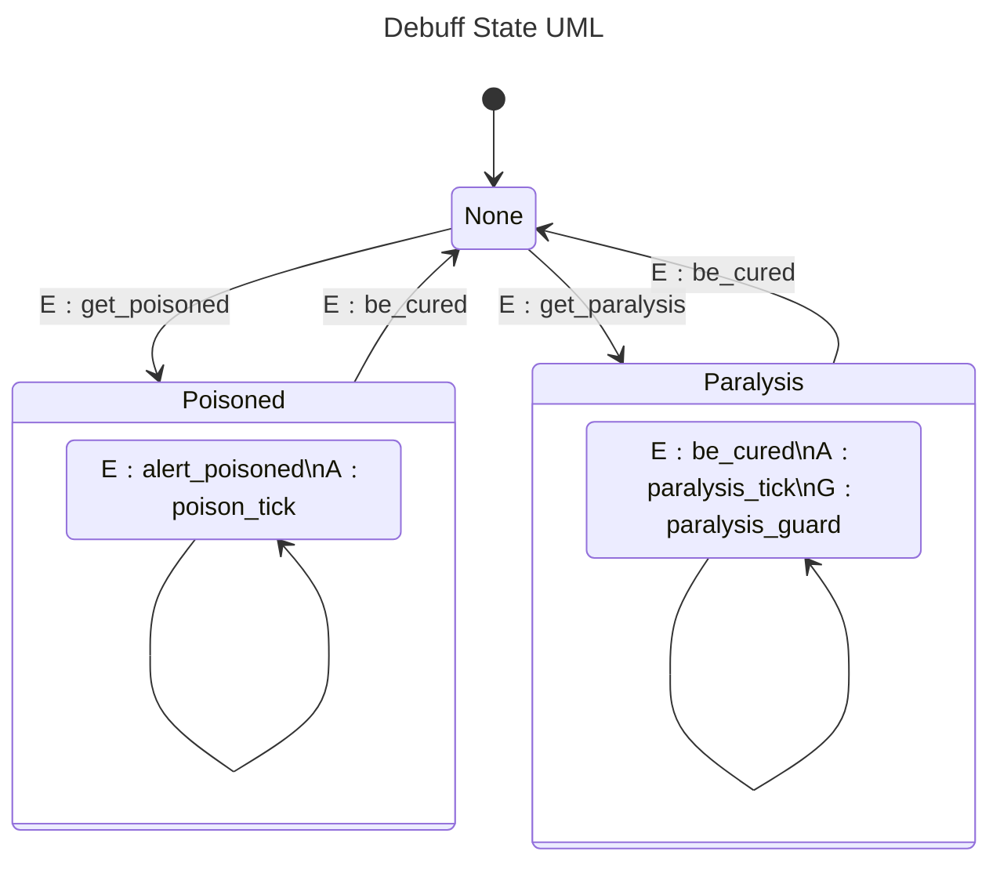
poison_tick, paralysis_tick 등의 특정 액션을 수행하기 위해 내부 상태 전이를 따로 정의하였다.  

코드 적용법은 밑과 같다.  
```c++
// back-end header
#include <boost/msm/back/state_machine.hpp>

// front-end header
#include <boost/msm/front/state_machine_def.hpp>

// funtor row type header
#include <boost/msm/front/functor_row.hpp>

namespace msm = boost::msm;
namespace mpl = boost::mpl;

// 이벤트 정의
struct alert_poisoned
{
};
struct get_poisoned
{
};
struct get_paralysis
{
};
struct be_cured
{
    bool is_paralysis;
    be_cured(bool ps = false)
        : is_paralysis{ps}
    {
    }
};

struct DebuffStatus : public msm::front::state_machine_def<DebuffStatus>
{
    // 상태 정의
    struct None : public msm::front::state<>
    {
        template <class Event, class FSM>
        void on_entry(Event const &, FSM &)
        {
            std::cout << "entering: None" << std::endl;
        }
        template <class Event, class FSM>
        void on_exit(Event const &, FSM &)
        {
            std::cout << "leaving: None" << std::endl;
        }
    };
    struct Poisoned : public msm::front::state<>
    {
        template <class Event, class FSM>
        void on_entry(Event const &, FSM &)
        {
            std::cout << "entering: Poisoned" << std::endl;
        }
        template <class Event, class FSM>
        void on_exit(Event const &, FSM &)
        {
            std::cout << "leaving: Poisoned" << std::endl;
        }

        struct poison_tick
        {
            template <class EVT, class FSM, class SourceState, class TargetState>
            void operator()(EVT const &, FSM &, SourceState &, TargetState &)
            {
                std::cout << "You are poisoned!" << std::endl;
            }
        };

        // 내부 상태 전이 테이블 정의
        // Funtor를 이용하는 방식이 훨씬 간단하니 함수를 이용하는 방식은 생략한다.
        // msm::front::Internal<Event, Action, Guard> 순으로 적어주면 된다.
        // Action이나 Guard가 빠져야 한다면 Row와 같은 방식으로 msm::front::none을 적거나 인자를 생략해주면 된다.
        struct internal_transition_table : mpl::vector<
                                               msm::front::Internal<alert_poisoned, poison_tick>>
        {
        };
    };
    struct Paralysis : public msm::front::state<>
    {
        template <class Event, class FSM>
        void on_entry(Event const &, FSM &)
        {
            std::cout << "entering: Paralysis" << std::endl;
        }
        template <class Event, class FSM>
        void on_exit(Event const &, FSM &)
        {
            std::cout << "leaving: Paralysis" << std::endl;
        }

        struct paralysis_tick
        {
            template <class EVT, class FSM, class SourceState, class TargetState>
            void operator()(EVT const &, FSM &, SourceState &, TargetState &)
            {
                std::cout << "You are paralysis!" << std::endl;
            }
        };
        struct paralysis_guard
        {
            template <class EVT, class FSM, class SourceState, class TargetState>
            bool operator()(EVT const &evt, FSM &, SourceState &, TargetState &)
            {
                if (evt.is_paralysis)
                    std::cout << "You can't go back to None State!\n";
                return evt.is_paralysis;
            }
        };
        struct internal_transition_table : mpl::vector<
                                               msm::front::Internal<be_cured, paralysis_tick, paralysis_guard>>
        {
        };
    };

    // 시작 상태 정의
    using initial_state = None;

    struct transition_table : mpl::vector<
                                  msm::front::Row<None, get_poisoned, Poisoned>,
                                  msm::front::Row<None, get_paralysis, Paralysis>,
                                  msm::front::Row<Poisoned, be_cured, None>,
                                  msm::front::Row<Paralysis, be_cured, None>>
    {
    };
};

using DebuffState = msm::back::state_machine<DebuffStatus>;

int main()
{
    DebuffState df;

    df.start();

    // 중독 상태 돌입
    df.process_event(get_poisoned());

    // on_entry(), on_exit()는 수행되지 않고 poisone_tick 액션만 수행됨
    df.process_event(alert_poisoned());
    df.process_event(alert_poisoned());

    // 중독 상태 탈출
    df.process_event(be_cured());

    // 마비 상태 돌입
    df.process_event(get_paralysis());

    // 마비 상태 탈출 시도...는 실패한다.
    // internal transition은 기본 transition보다 우위이다.
    // paralysis_guard의 반환 값은 true이기에 paralysis_guard만 수행된다.
    df.process_event(be_cured(true));

    // 요번에는 마비 상태에서 탈출한다.
    // paralysis_guard의 반환 값이 false이기에 internal transition은 막히고 기본 상태 전이가 수행된다.
    df.process_event(be_cured(false));

    df.stop();

    return 0;
}
```
대부분의 설명은 주석에 적혀있다.  
중요한 부분은 내부 상태 전이가 기본 상태 전이보다 우위라는 것이다.  
Funtor를 이용한 internal_transition_table 정의 방식이 워낙 편하기에 함수를 이용한 internal_transition_table 정의 방식은 생략한다.  
궁금하다면 [이곳](https://www.boost.org/doc/libs/1_82_0/libs/msm/doc/HTML/ch03s02.html#internal-transitions)을 참고하자.  
&nbsp;  

### 명시적 진입  

특정 SubState로 바로 진입하고 싶을 때 사용한다.  
UML은 밑과 같다.  
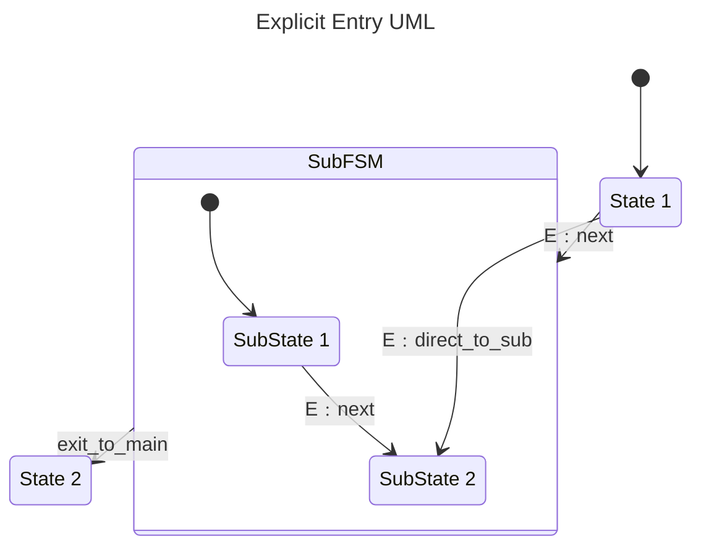
direct_to_sub 이벤트로 SubFSM의 Entry를 무시하고 바로 SubState 2로 이동이 가능하다.  
&nbsp;  

이를 구현한 코드는 밑과 같다.  
```c++
// back-end header
#include <boost/msm/back/state_machine.hpp>

// front-end header
#include <boost/msm/front/state_machine_def.hpp>

// funtor row type header
#include <boost/msm/front/functor_row.hpp>

// for mpl_list
#include <boost/mp11/mpl_list.hpp>

namespace msm = boost::msm;
namespace mp11 = boost::mp11;

// 이벤트 정의
struct next
{
};
struct direct_to_sub
{
};
struct exit_to_main
{
};

// FSM 정의
struct MyFSM_ : public msm::front::state_machine_def<MyFSM_>
{
    struct State_1 : public msm::front::state<>
    {
    };

    struct State_2 : public msm::front::state<>
    {
    };

    // SubState를 담고 있는 FSM 정의
    struct SubFSM_ : public msm::front::state_machine_def<SubFSM_>
    {
        struct SubState_1 : public msm::front::state<>
        {
        };

        // SubState 2는 explicit_entry를 상속하여 명시적 진입점이라고 표시함.
        // explicit_entry에 넘겨지는 템플릿 인자는 Zone 인덱스이다.
        // 동시 상태가 아닌 SubFSM은 Zone이 하나이기에 템플릿 인자에 0을 넣었다.
        struct SubState_2 : public msm::front::state<>,
                            public msm::front::explicit_entry<0>
        {
        };

        using initial_state = SubState_1;

        using transition_table = mp11::mp_list<msm::front::Row<SubState_1, next, SubState_2>>;
    };

    using SubFSM = msm::back::state_machine<SubFSM_>;

    using initial_state = State_1;

    // 명시적 진입 관계는 SubFSM 밖에서 이루어져야 한다.  
    using transition_table = mp11::mp_list<msm::front::Row<State_1, next, SubFSM>,
                                           msm::front::Row<SubFSM, exit_to_main, State_2>,
                                           // State 1에서 direct_to_sub 이벤트를 통해 바로 SubState 2로 진입하는 관계는 밑과 같이 표시한다.
                                           // 유의할 것은 direct는 state_machine 자료형인 SubFSM에서 끌어다 쓰고 SubState_2는 SubFSM_에서 끌어다 사용한다는 점이다.
                                           msm::front::Row<State_1, direct_to_sub, SubFSM::direct<SubFSM_::SubState_2>>>;
};

using MyFSM = msm::back::state_machine<MyFSM_>;

int main()
{

    MyFSM fsm;
    fsm.start();
    fsm.process_event(direct_to_sub());
    fsm.process_event(exit_to_main());
    fsm.stop();

    return 0;
}
```
대부분의 설명은 주석에 남겨놓았다.  
explicit_entry에 넘겨지는 템플릿 인자는 initial_state에 정의된 순서를 따라간다.  
예를 들어 ```using initial_state = mpl::vector<State_1, State_2>;```라면 Zone 인덱스는 State_1는 0번, State_2는 1번이다.  
explicit_entry 기능을 사용하는 경우 explicit_creation도 함께 사용하는 것이 좋은데 해당 기능은 [Forks](#forks) 목차에서 다룬다.  

```SubState 2 -- E﹕back_to_main --> State 1```과 같은 명시적 탈출 기능은 따로 없기 때문에 Guard를 통해 구현해야 한다.  
```c++
// 이벤트 추가
struct back_to_main
{
};

// 가드 추가
struct ExitGuard
{
    template <class Fsm, class Evt, class SourceState, class TargetState>
    bool operator()(Evt const &event, Fsm &fsm, SourceState &src, TargetState &trg)
    {
        return src.current_state()[0] == 1; // SubState 2가 아니면 false 반환
    }
};

// MyFSM_에 관계 추가
msm::front::Row<SubFSM, back_to_main, State_1, msm::front::none, ExitGuard>
```
위와 같은 구현을 알맞은 곳에 추가하면 될 것이다.  
&nbsp;  

### Forks  

Orthogonal regions이 사용되는 곳에 명시적으로 특정 상태에 진입하고 싶다면 Forks를 이용한다.   
밑 UML을 보면 상황 이해가 쉽다.   
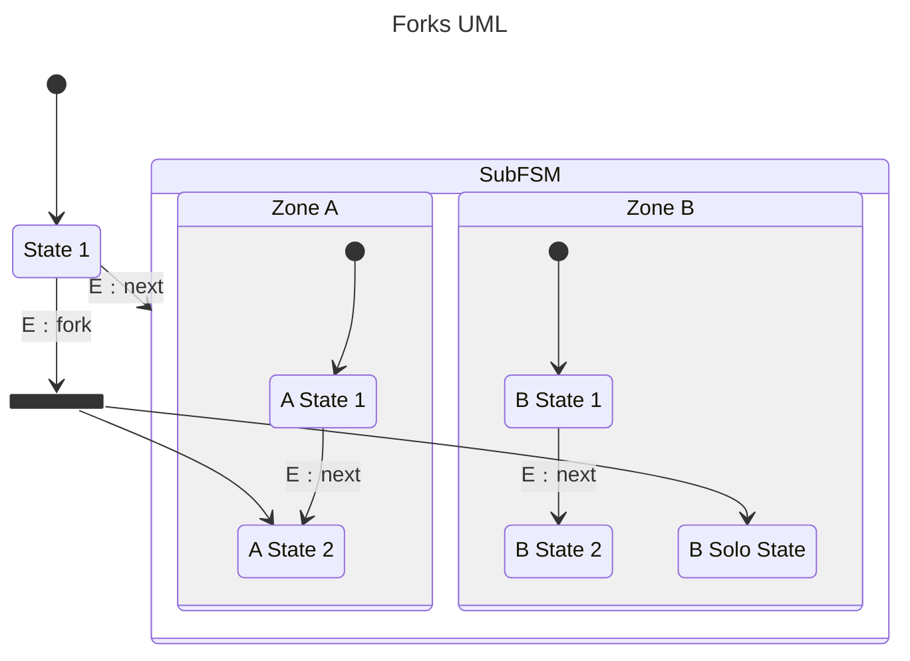
next 이벤트로 SubFSM을 진입하면 자동으로 A State 1, B State 1이 활성화되겠지만 fork 이벤트로 SubFSM을 진입하면 A State 2, B Solo State가 활성화된다.  
&nbsp;  

위 UML을 구현한 코드는 밑과 같다.  
```c++
// back-end header
#include <boost/msm/back/state_machine.hpp>

// front-end header
#include <boost/msm/front/state_machine_def.hpp>

// funtor row type header
#include <boost/msm/front/functor_row.hpp>

// for mpl_list
#include <boost/mp11/mpl_list.hpp>

namespace msm = boost::msm;
namespace mp11 = boost::mp11;

// 이벤트 정의
struct next
{
};
struct fork
{
};

struct MyFSM_ : public msm::front::state_machine_def<MyFSM_>
{
    struct State_1 : public msm::front::state<>
    {
    };

    struct SubFSM_ : public msm::front::state_machine_def<SubFSM_>
    {
        struct AState_1 : public msm::front::state<>
        {
        };

        // Zone A에서 fork될 상태
        struct AState_2 : public msm::front::state<>,
                          public msm::front::explicit_entry<0>
        {
        };

        struct BState_1 : public msm::front::state<>
        {
        };

        struct BState_2 : public msm::front::state<>
        {
        };

        // Zone B에서 fork될 상태
        struct BSoloState : public msm::front::state<>,
                            public msm::front::explicit_entry<1>
        {
        };

        using initial_state = mp11::mp_list<AState_1, BState_1>;

        // explicit_entry 기능을 이용할 때는 항상 explicit_creation를 해줄 상태가 있는지 검사해야 한다.
        // BSoloState와 같이 내부적인 transition_table에 정의되지 않은 녀석은 컴파일러가 최적화하면서 상태 생성을 건너뛰어 버릴 수도 있기에 explicit_creation으로 명시하는 것이 좋다.
        using explicit_creation = mp11::mp_list<BSoloState>;

        using transition_table = mp11::mp_list<msm::front::Row<AState_1, next, AState_2>,
                                               msm::front::Row<BState_1, next, BState_2>>;
    };

    using SubFSM = msm::back::state_machine<SubFSM_>;

    using initial_state = State_1;

    // fork할 진입점들을 mpl::vector나 mp11::mp_list로 넘겨주면 된다.  
    using transition_table = mp11::mp_list<msm::front::Row<State_1, next, SubFSM>,
                                           msm::front::Row<State_1, fork, mp11::mp_list<SubFSM::direct<SubFSM_::AState_2>, SubFSM::direct<SubFSM_::BSoloState>>>>;
};

using MyFSM = msm::back::state_machine<MyFSM_>;

int main()
{
    MyFSM fsm;
    fsm.start();
    fsm.process_event(fork());
    fsm.stop();

    return 0;
}
```
주석에 설명을 써놓았다.  
위와 같은 동시 상태의 경우 직접 진입이던 fork던 특정 Zone이 활성화 되면 관계가 정의되지 않은 나머지 Zone들은 initial_state의 상태를 따라간다.  
&nbsp;  

### 유사 진입 / 유사 종료  

특정 상태에 여러 진입점, 여러 탈출점을 만들 수 있다.  
일단 UML을 보자.  
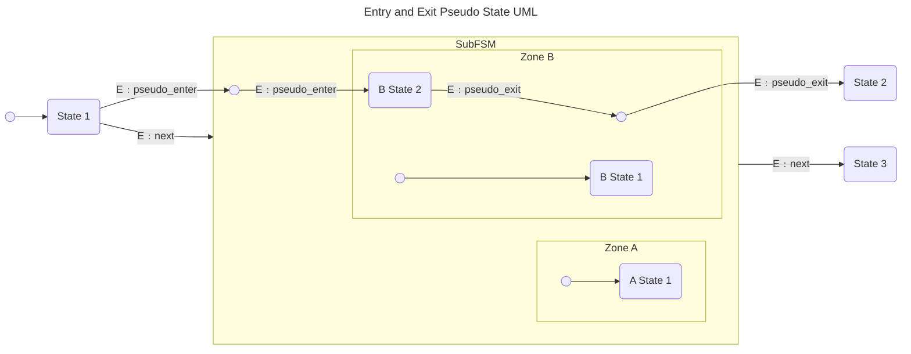
State 1에서 next 이벤트가 발생하면 기본 진입점으로 인해 A State 1, B State 1이 활성화 될 것이다.  
반면 pseudo_enter 이벤트가 발생하면 유사 진입점을 이용하기에 A State 1, B State 2가 활성화된다.  
B State 2는 next, pseudo_exit를 이용하여 SubFSM을 탈출할 수 있다.  
&nbsp;  

이를 구현한 코드를 보자.  
```c++
// back-end header
#include <boost/msm/back/state_machine.hpp>

// front-end header
#include <boost/msm/front/state_machine_def.hpp>

// funtor row type header
#include <boost/msm/front/functor_row.hpp>

// for mpl_list
#include <boost/mp11/mpl_list.hpp>

namespace msm = boost::msm;
namespace mp11 = boost::mp11;

// 이벤트 정의
struct next
{
};
struct pseudo_enter
{
};
struct pseudo_exit
{
};

struct MyFSM_ : public msm::front::state_machine_def<MyFSM_>
{
    struct State_1 : public msm::front::state<>
    {
    };
    struct State_2 : public msm::front::state<>
    {
    };
    struct State_3 : public msm::front::state<>
    {
    };

    struct SubFSM_ : public msm::front::state_machine_def<SubFSM_>
    {
        struct AState_1 : public msm::front::state<>
        {
        };
        struct BState_1 : public msm::front::state<>
        {
        };
        struct BState_2 : public msm::front::state<>
        {
        };

        // 유사 진입점 설정
        // 템플릿 인자에는 유사 진입점이 존재할 Zone 인덱스가 들어감
        // B State가 있는 곳에 유사 진입점을 추가할 것이기에 1로 설정
        struct PseudoEntry : public msm::front::entry_pseudo_state<1>
        {
        };

        // 유사 탈출점 설정
        // 템플릿 인자에는 탈출할 이벤트가 들어감
        // 밑은 pseudo_exit 이벤트로 유사 탈출점에서 다른 상태로 이동할 수 있다는 것을 의미한다.   
        struct PseudoExit : public msm::front::exit_pseudo_state<pseudo_exit>
        {
        };

        using initial_state = mp11::mp_list<AState_1, BState_1>;

        using transition_table = mp11::mp_list<msm::front::Row<PseudoEntry, pseudo_enter, BState_2>,
                                               // 유사 탈출점을 이용하는 관계 설정
                                               msm::front::Row<BState_2, pseudo_exit, PseudoExit>>;
    };

    using SubFSM = msm::back::state_machine<SubFSM_>;

    using initial_state = State_1;

    using transition_table = mp11::mp_list<msm::front::Row<State_1, next, SubFSM>,
                                           msm::front::Row<SubFSM, next, State_3>,
                                           // 유사 진입점은 entry_pt를 통해 상태를 이용한다.  
                                           msm::front::Row<State_1, pseudo_enter, SubFSM::entry_pt<SubFSM_::PseudoEntry>>,
                                           // 유사 탈출점은 exit_pt를 통해 상태를 이용한다.
                                           msm::front::Row<SubFSM::exit_pt<SubFSM_::PseudoExit>, pseudo_exit, State_2>>;
};

using MyFSM = msm::back::state_machine<MyFSM_>;

int main()
{
    MyFSM fsm;
    fsm.start();
    fsm.process_event(pseudo_enter());
    fsm.process_event(pseudo_exit());
    fsm.stop();

    return 0;
}
```
유사 진입점으로 들어가는 이벤트와 유사 진입점에서 나오는 이벤트는 동일해야 한다. (위 예시에서는 pseudo_enter로 동일)  
유사 탈출점은 들어가는 이벤트와 나오는 이벤트가 굳이 동일할 필요는 없는데 다르면 사용하기 껄끄럽다. (껄끄러운 사용법은 [이곳](https://www.boost.org/doc/libs/1_82_0/libs/msm/doc/HTML/ch03s02.html#d0e875)을 참조하자.)  
유사하다곤 해도 진입점, 탈출점이기에 이벤트를 중복으로 발생시키지 않아도 다음 상태로 자동으로 넘어간다.  
예를 들어 현재 관계 테이블이 정의된 모습으로 판단해보면 ```State 1 -- pseudo_enter --> Pseudo Entry -- pseudo_enter --> B State 2``` 이렇게 보인다.  
하지만 State 1 상태에서 pseudo_enter를 한 번 발생시켜도 B State 2 상태로 전이된다.  
Pseudo Entry는 그저 거쳐가는 관문일 뿐이다.  
&nbsp;  

### Anonymous Transition  

익명의 전이, 즉 그냥 거쳐가는 상태를 의미한다.  
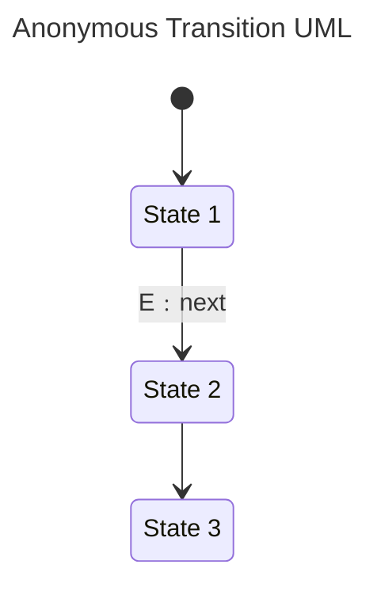
위 UML을 보자.  
State 1 상태에서 next 이벤트가 발생하면 State 2를 거쳐 자동으로 State 3에 도착하게 된다.  
&nbsp;  

이런 관계를 정의하려면 transition_table은 밑과 같이 정의되어야 한다.  
```c++
using transition_table = mp11::mp_list<msm::front::Row<State_1, next, State_2>,
                                       msm::front::Row<State_2, msm::front::none, State_3>>;
```
이벤트에 none을 넣어두면 곧바로 다음 상태로 전이된다.  
Anonymous Transition 기능은 Guard를 이용해 상태의 if/else문 구현을 가능하게 해줘 유용하다.  
&nbsp;  

### Base State Type  

상태들이 공통적인 구현부를 자주 이용해야 할 때 Base State 상속 기능을 사용하면 좋다.   
여태 보았던 구현부에서 상태 구조체들은 모두 ```state<>```를 상속하고 있는데 ```state<기본 상태 자료형>``` 이렇게 사용할 수도 있다.  
&nbsp;  

구현하려는 UML은 간단하다.  
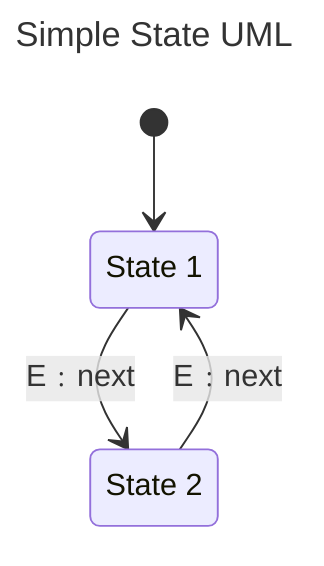
&nbsp;  

Base State를 사용한 구현은 밑과 같다.  
```c++
// back-end header
#include <boost/msm/back/state_machine.hpp>

// front-end header
#include <boost/msm/front/state_machine_def.hpp>

// funtor row type header
#include <boost/msm/front/functor_row.hpp>

// for mpl_list
#include <boost/mp11/mpl_list.hpp>

namespace msm = boost::msm;
namespace mp11 = boost::mp11;

// 이벤트 정의
struct next
{
};

// Base State 정의
// Base State는 FSM이나 상태로 하여금 중복된 로직을 줄여주거나 가상 함수를 사용할 수 있게 해준다.
struct BaseState
{
    void print_on_entry(const std::string &content)
    {
        std::cout << "On Entry Function Called!\n"
                  << content;
    }

    void print_on_exit(const std::string &content)
    {
        std::cout << "On Exit Function Called!\n"
                  << content;
    }

    virtual void virtual_func() = 0;
};

// 사용할 FSM에 BaseState를 state_machine_def 템플릿 인자로 넘겨줄 수 있다.
struct MyFSM : public msm::front::state_machine_def<MyFSM, BaseState>
{
    template <class Event, class FSM>
    void on_entry(Event const &, FSM &)
    {
        print_on_entry("Start MyFSM!\n");
    }
    template <class Event, class FSM>
    void on_exit(Event const &, FSM &)
    {
        print_on_exit("End MyFSM!\n");
    }
    void virtual_func()
    {
        std::cout << "virtual_func for MyFSM!\n";
    }

    // 상태도 FSM과 마찬가지로 state 템플릿 인자에 BaseState를 넘겨줄 수 있다.  
    struct State_1 : public msm::front::state<BaseState>
    {
        template <class Event, class FSM>
        void on_entry(Event const &, FSM &)
        {
            print_on_entry("Enter State_1!\n");
        }
        template <class Event, class FSM>
        void on_exit(Event const &, FSM &)
        {
            print_on_exit("End State_1!\n");
        }
        void virtual_func()
        {
            std::cout << "virtual_func for State_1!\n";
        }
    };

    struct State_2 : public msm::front::state<BaseState>
    {
        template <class Event, class FSM>
        void on_entry(Event const &, FSM &)
        {
            print_on_entry("Enter State_2!\n");
        }
        template <class Event, class FSM>
        void on_exit(Event const &, FSM &)
        {
            print_on_exit("End State_2!\n");
        }
        void virtual_func()
        {
            std::cout << "virtual_func for State_2!\n";
        }
    };

    // 시작 상태 정의
    using initial_state = State_1;

    // 관계 정의
    using transition_table = mp11::mp_list<msm::front::Row<State_1, next, State_2>,
                                           msm::front::Row<State_2, next, State_1>>;
};

using MyStateMachine = msm::back::state_machine<MyFSM>;

int main()
{
    MyStateMachine msm;
    msm.start();
    msm.process_event(next());
    msm.process_event(next());
    msm.stop();

    return 0;
}
```
FSM, State 1, State 2는 BaseState를 이용하여 동일한 로직을 줄이고 가상 함수를 구현하고 있다.  
위 예시에서는 FSM, State 1, State 2 모두 BaseState를 상속하고 있지만 상속은 자유다.  
FSM은 BaseState 상속을 안하는데 State 1, State 2는 상속을 할 수 있다.  
State 2만 BaseState 상속을 할 수도 있고 FSM만 BaseState 상속을 할 수도 있다.  
&nbsp;  

#### Visitor  

Base State 기능을 이용하여 [방문자 패턴](https://github.com/tongmon/fundamental-practice/blob/master/Programming%20Pattern/Behavioral%20Pattern/Visitor.md)을 구현할 수도 있다.  
FMS에서 ```visit_current_states()``` 함수를 호출하여 이용이 가능하다.  
구현하고자 하는 UML은 [Base State 목차](#base-state-type)와 동일하다.  

상호 참조를 방지하기 위해 방문자 코드는 .cpp, .hpp 파일로 분리해야 한다.  
먼저 Visitor.hpp 파일의 구현부는 밑과 같다.  
```c++
// back-end header
#include <boost/msm/back/state_machine.hpp>

// front-end header
#include <boost/msm/front/state_machine_def.hpp>

namespace msm = boost::msm;

struct State_1;
struct State_2;

// 방문자 정의
struct Visitor
{
    virtual void visit(State_1 &) = 0;
    virtual void visit(State_2 &) = 0;
};

struct ConsolePrintVisitor : Visitor
{
    void visit(State_1 &obj);
    void visit(State_2 &obj);
};

struct HelloWorldVisitor : Visitor
{
    void visit(State_1 &obj);
    void visit(State_2 &obj);
};
```
순환 방문자 방식을 이용한다.  
새로운 상태 구조체가 추가될 때마다 해당 상태에 대한 visit() 함수를 추가해줘야 한다.  
Visitor 상속시 모든 상태마다 visit() 함수 구현이 강제되는 것이 싫다면 ```= 0```을 ```{}```로 바꿔 그냥 가상 함수로 만들어주면 된다.  
&nbsp;  

Visitor.cpp 파일의 구현부는 밑과 같다.  
```c++
#include "Visitor.hpp"
#include "FSM.hpp"

void ConsolePrintVisitor::visit(State_1 &obj)
{
    std::cout << "State_1 Visitor Called!\n";
}

void ConsolePrintVisitor::visit(State_2 &obj)
{
    std::cout << "State_2 Visitor Called!\n";
}

void HelloWorldVisitor::visit(State_1 &obj)
{
    std::cout << "Hello World From State_1!\n";
}

void HelloWorldVisitor::visit(State_2 &obj)
{
    std::cout << "Hello World From State_2!\n";
}
```
ConsolePrintVisitor와 HelloWorldVisitor의 내부 로직이 다른 것을 볼 수 있다.  
&nbsp;  

FSM이 구현된 FSM.hpp는 밑과 같다.  
```c++
// back-end header
#include <boost/msm/back/state_machine.hpp>

// front-end header
#include <boost/msm/front/state_machine_def.hpp>

// funtor row type header
#include <boost/msm/front/functor_row.hpp>

// for mpl_list
#include <boost/mp11/mpl_list.hpp>

namespace msm = boost::msm;
namespace mp11 = boost::mp11;

struct Visitor;

// 방문자 Base State 정의
struct VisitableState
{
    // 밑에서 정의할 accept 함수 형식을 accept_sig에 선언한다.
    using accept_sig = msm::back::args<void, Visitor &>;

    // vtable 생성을 위해 적어도 하나의 virtual 관련 생성자 혹은 함수는 있어야 한다.
    virtual ~VisitableState()
    {
    }

    // 방문자의 역할을 하기위해 반드시 accept라는 이름의 함수가 있어야 한다.
    // 상태들이 accept() 함수를 정의해야 하는 강제성을 없애기 위해 순수 가상 함수를 사용하지 않았다.  
    void accept(Visitor &obj)
    {
    }
};

struct State_1 : public msm::front::state<VisitableState>
{
    // Visitor를 호출하기 위해 accept 함수를 재정의한다.
    void accept(Visitor &vis);
};

// Visitor를 이용하기 싫다면 accept 함수를 정의하지 않으면 된다.
struct State_2 : public msm::front::state<VisitableState>
{
};

// 이벤트 정의
struct next
{
};

// 사용할 FSM에 VisitableState를 state_machine_def 템플릿 인자로 넘겨줘야 한다.
struct MyFSM : public msm::front::state_machine_def<MyFSM, VisitableState>
{
    // 시작 상태 정의
    using initial_state = State_1;

    // 관계 정의
    using transition_table = mp11::mp_list<msm::front::Row<State_1, next, State_2>,
                                           msm::front::Row<State_2, next, State_1>>;
};

using MyStateMachine = msm::back::state_machine<MyFSM>;
```
visit_current_states()를 이용하기 위해선 각 상태 구조체뿐만 아니라 FSM도 동일한 VisitableState를 템플릿 인자로 넘겨줘야 한다.  
&nbsp;  

FSM.cpp에서는 accept() 함수만 정의해주면 된다.  
```c++
#include "FSM.hpp"
#include "Visitor.hpp"

// 알맞은 방문자를 호출한다.
void State_1::accept(Visitor &vis)
{
    vis.visit(*this);
}
```
VisitableState에 기본적인 accept() 함수가 정의되어 있기에 State_2에서 따로 accept() 함수를 정의하지 않아도 된다.  
&nbsp;  

활용은 밑과 같다.  
```c++
#include "FSM.hpp"
#include "Visitor.hpp"

int main()
{
    // 이용할 방문자 정의
    ConsolePrintVisitor vis_1;
    HelloWorldVisitor vis_2;

    MyStateMachine msm;

#pragma region ConsolePrintVisitor 이용

    msm.start();

    // State 1 상태에서 방문자 함수 수행
    msm.visit_current_states(boost::ref(vis_1));

    msm.process_event(next());

    // State 2 상태에서 방문자 함수 수행
    // accept() 함수를 따로 정의하지 않았기에 수행되지 않음
    msm.visit_current_states(boost::ref(vis_1));

    msm.stop();

#pragma endregion

#pragma region HelloWorldVisitor 이용

    msm.start();

    // State 1 상태에서 방문자 함수 수행
    msm.visit_current_states(boost::ref(vis_2));

    msm.process_event(next());

    // State 2 상태에서 방문자 함수 수행
    // accept() 함수를 따로 정의하지 않았기에 수행되지 않음
    msm.visit_current_states(boost::ref(vis_2));

    msm.stop();

#pragma endregion

    return 0;
}
```
visit_current_states() 함수를 이용하여 현재 상태를 함수의 인자로 받는 방문자를 이용할 수 있다.  
참조 인자는 ```boost::ref```, ```boost::cref```를 이용하여 넘긴다.  
&nbsp;  

구현한 방문자 함수에 인자를 추가할 수도 있다.  
먼저 VisitableState을 수정해보자.  
```c++
struct VisitableState
{
    // 동일 구현 생략

    using accept_sig = msm::back::args<void, Visitor &, std::string*>;

    void accept(Visitor &obj, std::string*)
    {
    }
};
```
accept_sig에 스트링 포인터를 추가하고 accept() 함수의 인자도 그에 맞게 바꿔준다.  
&nbsp;  

각 상태에 accept() 함수가 존재한다면 알맞게 수정해준다.  
```c++
struct State_1 : public msm::front::state<VisitableState>
{
    // 동일 구현 생략

    void accept(Visitor &vis, std::string *);
};

void State_1::accept(Visitor &vis, std::string *str)
{
    vis.visit(*this, str);
}
```
&nbsp;  

Visitor 함수의 선언부와 정의부도 알맞게 바꿔주자.  
```c++
struct Visitor
{
    virtual void visit(State_1 &, std::string *) = 0;
    virtual void visit(State_2 &, std::string *) = 0;
};

struct ConsolePrintVisitor : Visitor
{
    void visit(State_1 &obj, std::string *str);
    void visit(State_2 &obj, std::string *str);
};

struct HelloWorldVisitor : Visitor
{
    void visit(State_1 &obj, std::string *str);
    void visit(State_2 &obj, std::string *str);
};

void ConsolePrintVisitor::visit(State_1 &obj, std::string *str) { /*생략*/ }

void ConsolePrintVisitor::visit(State_2 &obj, std::string *str) { /*생략*/ }

void HelloWorldVisitor::visit(State_1 &obj, std::string *str) { /*생략*/ }

void HelloWorldVisitor::visit(State_2 &obj, std::string *str) { /*생략*/ }
```
&nbsp;  

활용은 밑과 같다.  
```c++
HelloWorldVisitor vis;
MyStateMachine msm;
std::string my_str = "My Data";
msm.visit_current_states(boost::ref(vis), &my_str);
```
유의할 점은 현재 accept() 함수의 인자가 2개라서 따로 지정은 안해줬는데 accept() 함수 인자 개수가 3개를 넘어가면 반드시 BOOST_MSM_VISITOR_ARG_SIZE 매크로를 4 이상으로 재정의해줘야 한다.  
당연히 대부분의 Boost 관련 매크로가 그러하듯 헤더 선언 전에 해줘야 한다.  
&nbsp;  

### 생성자  

FSM이나 특정 상태에 생성자를 추가하고 싶을 수도 있다.  
Boost MSM은 이를 지원한다.  

구현법에 앞서 UML을 보자.  
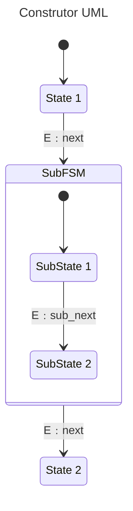
&nbsp;  

위 UML을 구현한 코드는 밑과 같다.  
```c++
// back-end header
#include <boost/msm/back/state_machine.hpp>

// front-end header
#include <boost/msm/front/state_machine_def.hpp>

// funtor row type header
#include <boost/msm/front/functor_row.hpp>

// for mpl_list
#include <boost/mp11/mpl_list.hpp>

namespace msm = boost::msm;
namespace mp11 = boost::mp11;

// 이벤트 정의
struct next
{
};
struct sub_next
{
};

struct MyFSM_ : public msm::front::state_machine_def<MyFSM_>
{
    std::string name;
    int id;

    MyFSM_(const char *fsm_name, int id)
        : name{fsm_name}
    {
    }

    struct State_1 : public msm::front::state<>
    {
        int state_1_data;
        State_1(int data = 0)
            : state_1_data{data}
        {
        }
    };

    struct State_2 : public msm::front::state<>
    {
        std::string state_2_data;
        State_2(const std::string &data = "")
            : state_2_data{data}
        {
        }
    };

    struct SubFSM_ : public msm::front::state_machine_def<SubFSM_>
    {
        double subfsm_data;
        SubFSM_(double data = 0.0)
            : subfsm_data{data}
        {
        }

        struct SubState_1 : public msm::front::state<>
        {
        };

        struct SubState_2 : public msm::front::state<>
        {
            float substate_2_data;
            SubState_2()
            {
                substate_2_data = 0.f;
            }
            SubState_2(float &data)
                : substate_2_data{data}
            {
            }
        };

        using initial_state = SubState_1;

        using transition_table = mp11::mp_list<msm::front::Row<SubState_1, sub_next, SubState_2>>;
    };

    using SubFSM = msm::back::state_machine<SubFSM_>;

    using initial_state = State_1;

    using transition_table = mp11::mp_list<msm::front::Row<State_1, next, SubFSM>,
                                           msm::front::Row<SubFSM, next, State_2>>;
};

using MyFSM = msm::back::state_machine<MyFSM_>;

int main()
{
    float data_for_fsm = 1.f;

    // 첫번째 생성자 활용법
    // 객체 생성하면서 바로 필요한 인자를 넘긴다.
    MyFSM msm("my fsm", 1);

    // 나머지 상태들은 밑과 같이 초기화 할 수 있다.
    // C++ 버퍼를 다루는 방식과 인터페이스가 유사하다.  
    msm.set_states(msm::back::states_ << MyFSM_::State_1(13));
    msm.set_states(msm::back::states_ << MyFSM_::State_2("my data"));

    // SubState와 그것들을 담고 있는 SubFSM 초기화는 밑과 같다.
    // SubState에 대한 초기화를 진행한 후 SubFSM 생성자에 대한 인자들을 넘긴다.
    msm.set_states(msm::back::states_ << MyFSM_::SubFSM(msm::back::states_ << MyFSM_::SubFSM_::SubState_2(boost::ref(data_for_fsm),
                                                        3.0));

    // 객체 생성시 한방에 진행할 수도 있다.
    // 여기도 마찬가지로 상태에 대한 초기화를 마치고 FSM 자신의 생성자에 대한 인자들을 넘긴다.
    MyFSM fsm(msm::back::states_ << MyFSM_::State_1(13)
                                 << MyFSM_::State_2("my data")
                                 << MyFSM_::SubFSM(msm::back::states_ << MyFSM_::SubFSM_::SubState_2(boost::ref(data_for_fsm)),
                                                   7.0),
              "my fsm", 1);

    return 0;
}
```
설명은 주석에 써놓았다.  
&nbsp;  

### 이벤트 상속  

밑과 같은 UML 관계가 있다.  
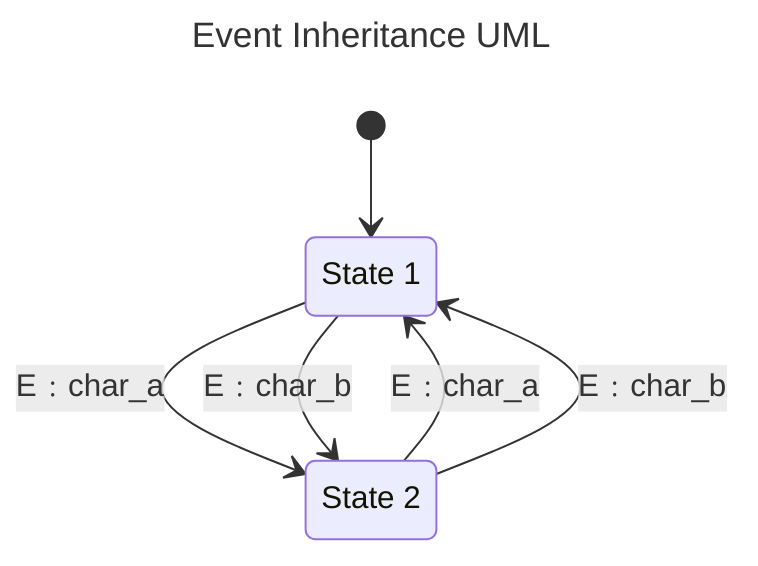
char_a, char_b 이벤트 모두 State 1, State 2 간의 전이를 가능하게 한다.  
&nbsp;  

해당 관계를 어떻게 줄일 수 있는지 코드를 보면 이해가 된다.  
```c++
// back-end header
#include <boost/msm/back/state_machine.hpp>

// front-end header
#include <boost/msm/front/state_machine_def.hpp>

// funtor row type header
#include <boost/msm/front/functor_row.hpp>

// for mpl_list
#include <boost/mp11/mpl_list.hpp>

namespace msm = boost::msm;
namespace mp11 = boost::mp11;

// 이벤트 정의
struct letter
{
};
// letter라는 이벤트를 상속한다.
struct char_a : public letter
{
};
struct char_b : public letter
{
};

struct MyFSM_ : public msm::front::state_machine_def<MyFSM_>
{
    struct State_1 : public msm::front::state<>
    {
    };

    struct State_2 : public msm::front::state<>
    {
    };

    using initial_state = State_1;

    /*
    굳이 밑과 같이 정의하지 않아도 된다.
    using transition_table = mp11::mp_list<msm::front::Row<State_1, char_a, State_2>,
                                           msm::front::Row<State_2, char_b, State_1>,
                                           msm::front::Row<State_1, char_a, State_2>,
                                           msm::front::Row<State_2, char_b, State_1>>;
    */

    // 부모 이벤트를 이용해서 관계를 정의할 수 있다.  
    using transition_table = mp11::mp_list<msm::front::Row<State_1, letter, State_2>,
                                           msm::front::Row<State_2, letter, State_1>>;
};

using MyFSM = msm::back::state_machine<MyFSM_>;

int main()
{
    MyFSM fsm;
    fsm.start();
    fsm.process_event(char_a());
    fsm.process_event(char_b());
    fsm.process_event(char_b());
    fsm.process_event(char_a());
    fsm.stop();

    return 0;
}
```
이벤트 상속 관계를 이용해 관계 테이블을 좀 더 깔끔하게 작성할 수 있다.  
&nbsp;  

### 정확한 상태 전이 시점  

먼저 UML을 보자.  
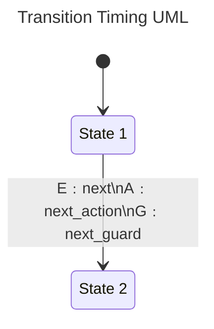
일단 기본적으로 ```next --> State 1 [on_exit] --> next_guard --> next_action --> State 2 [on_entry]``` 이러한 순서로 실행될 것이다.  
위에서 next 이벤트가 발생하는 경우 정확히 어느 시점에 상태가 State 2로 변경되는가?  
next 이벤트가 발생한 직후 바로? 아니면 next_action이 수행되고? 아니면 State 2의 on_entry() 함수가 수행될 때?  
이를 명확하게 해주려면 active_state_switch_policy를 재정의해야 한다.  

방법의 종류는 밑과 같다.  

1. active_state_switch_after_entry  
    State 2의 on_entry() 함수가 수행된 후 현재 상태가 State 2로 바뀐다.  
    active_state_switch_policy가 따로 지정되지 않으면 default로 해당 기능이 지정된다.  

1. active_state_switch_after_exit  
    State 1의 on_exit() 함수가 수행된 후 현재 상태가 State 2로 바뀐다.  

1. active_state_switch_before_transition  
    next_guard가 상태 전이를 허용한 후 현재 상태가 State 2로 바뀐다.  

1. active_state_switch_after_transition_action  
    next_action가 수행된 후 현재 상태가 State 2로 바뀐다.  
&nbsp;  

밑과 같이 사용할 수 있다.  
```c++
struct MyFsm : public boost::msm::front::state_machine_def<MyFsm>
{
    using active_state_switch_policy = boost::msm::active_state_switch_before_transition;

    // 나머지 구현부 생략  
};
```
&nbsp;  

## 요약  

1. 상태 패턴을 구축하는 경우 특정 클래스를 상태로 지정할 수도 있고 enum과 같은 특정 값을 상태로 지정할 수도 있다.  

2. 상용 수준의 복잡한 상태를 구현하려면 Boost MSM과 같은 외부 라이브러리를 이용하는 것이 바람직하다.  

3. 최근엔 상태의 개수가 굉장히 많아져도 관리가 용이한 행동 트리가 각광받고 있다.  
    C++도 이와 관련된 라이브러리 [BehaviorTree.CPP](https://github.com/BehaviorTree/BehaviorTree.CPP)가 존재하니 한 번 확인해보자.  