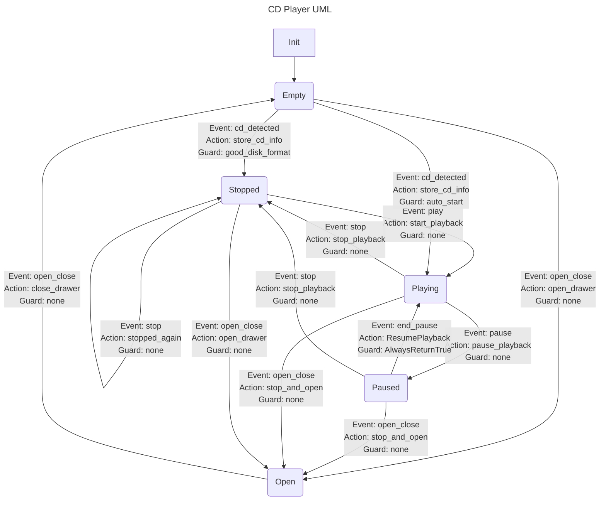
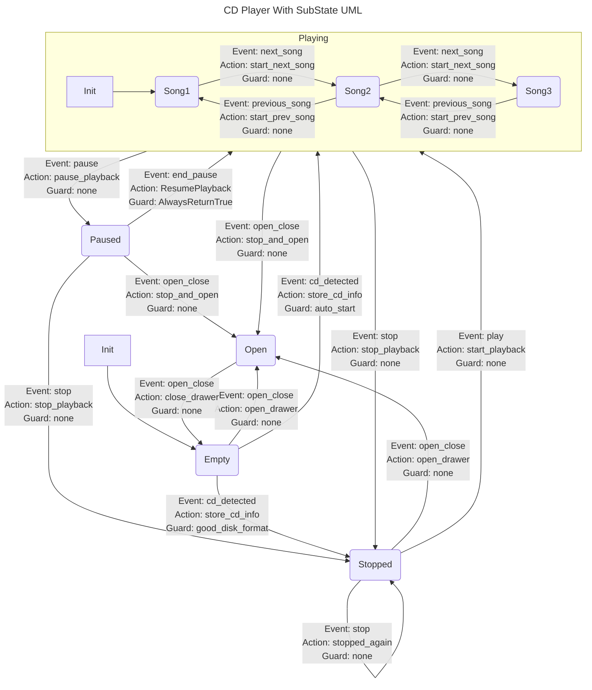

# State Pattern  

밑과 같은 상황을 생각해보자.  
```
졸음 --- 잠자기 ---> 정신이 듦
```
여기서 ```졸음```, ```정신이 듦```은 상태고 ```잠자기```는 동작이라고 볼 수 있다.  
위 예시처럼 ```상태가 동작을 제어하고, 상태는 바뀔 수 있다.```라는 아이디어에서 시작된 패턴이 상태 패턴이다.  

모든 행위가 특정 **상태**로 정의될 수 있다면 상황을 통제하기 굉장히 쉬워진다.  
정의되지 않은 상태는 발생하지 않으므로 안정적이다.  
주로 컴파일러, 임베디드, 게임 AI 등에 많이 활용된다.  

상태 패턴은 크게 두 가지 구현법으로 나뉜다.  

1. 동작이 정의된 실제 클래스를 상태로 사용한다.  
    해당 동작들은 상태가 변경될 때 클래스의 변화에 따라 변경된다.  

1. 상태, 동작을 enum과 같은 특정 식별자의 나열로 정의한다.  
    실제 동작에 대한 로직은 상태 기계(State Machine)라는 컴포넌트를 두어 수행한다.  

두 방식 모두 괜찮은 접근법이다.  
하지만 두 번째 방식이 훨씬 많이 사용된다.  
&nbsp;  

## Boost.MSM  

Boost의 [Meta State Machine(MSM)](https://www.boost.org/doc/libs/1_82_0/libs/msm/doc/HTML/index.html)은 상태를 표현하기 위해 유용한 [UML StateChart](https://en.wikipedia.org/wiki/UML_state_machine)를 코드에 적용하기 위해 탄생한 라이브러리이다.  
UML을 이용한 상태를 다루기에 간단한 상태부터 굉장히 복잡한 상태까지 모두 C++로 표현이 가능하다.  

MSM은 크게 [front-end](https://www.boost.org/doc/libs/1_82_0/libs/msm/doc/HTML/ch03s02.html)와 [back-end](https://www.boost.org/doc/libs/1_82_0/libs/msm/doc/HTML/ch03s05.html)로 나뉜다.  
front-end는 상태 구조체를 정의하는 부분이고 back-end는 구현된 상태 구조체를 실제로 사용하는 부분이다.  
front-end, back-end는 서로 맞물려 돌아가야 하기에 혼용해서 설명하겠다.  
&nbsp;  

### CD Player 예시  

아주 기초적인 MSM 예시를 보자.  
UML을 보기 전에 등장할 용어에 대해 알아야 한다.  
* Event  
    ```시작 상태``` ----> ```끝 상태```로 전이를 일으키는 이벤트를 뜻한다.  
    trigger 역할을 하기에 이벤트가 없으면 상태는 변하지 않는다.  

* Guard  
    ```시작 상태``` ----> ```끝 상태```로 전이가 가능한지 불가능한지 Guard가 반환 하는 값을 통해 알 수 있다.  
    Guard가 false를 반환한다면 이벤트가 발생해도 ```시작 상태```에 머무른다.  
    true를 반환해야만 ```끝 상태```로 전이될 수 있다.  

* Action  
    ```시작 상태``` ----> ```끝 상태```로 전이가 확정된 경우 발생하는 동작을 의미한다. (상태가 아니라 특정 동작이다.)   
    전이 중간에 수행되기에 ```시작 상태``` --- ```Action``` ---> ```끝 상태``` 이러한 순서라고 보면된다.  

먼저 UML은 밑과 같이 생겼다.  

UML을 잘 보면 Empty에서 발생되는 cd_detected 이벤트로만 Playing, Stopped 두 개로 이어지는데 이러면 충돌이 날 수 있다.  
이러한 충돌을 방지하려고 auto_start라는 Guard가 false를 반환해 Empty에서 Playing으로 연결되는 trigger인 cd_detected 이벤트를 비활성화한다.  
&nbsp;  

위 UML 관계가 정의된 코드는 밑과 같다.  
```c++
// back-end header
#include <boost/msm/back/state_machine.hpp>

// front-end header
#include <boost/msm/front/state_machine_def.hpp>

// funtor row type header
#include <boost/msm/front/functor_row.hpp>

#pragma region 이벤트 정의
struct play
{
};

struct end_pause
{
};

struct stop
{
};

struct pause
{
};

struct open_close
{
};

// 좀 더 복잡한 이벤트들은 이벤트 객체에 특정 데이터가 같이 들어감.
enum DiskTypeEnum
{
    DISK_CD = 0,
    DISK_DVD = 1
};
struct cd_detected
{
    cd_detected(std::string name, DiskTypeEnum diskType)
        : name(name),
          disc_type(diskType)
    {
    }

    std::string name;
    DiskTypeEnum disc_type;
};
#pragma endregion

// front-end: Finite State Machine(FSM)이 정의된 player_ 객체
// boost::msm::front::state_machine_def<자기 자신>를 상속하여 지정할 수 있다.
struct player_ : public boost::msm::front::state_machine_def<player_>
{
    // FSM 객체를 start() 함수로 호출하면 on_entry() 함수가 작동
    template <class Event, class FSM>
    void on_entry(Event const &, FSM &)
    {
        std::cout << "entering: Player" << std::endl;
    }

    // FSM 객체를 stop() 함수로 호출하면 on_exit() 함수가 작동
    template <class Event, class FSM>
    void on_exit(Event const &, FSM &)
    {
        std::cout << "leaving: Player" << std::endl;
    }

#pragma region FSM 객체에서 사용하는 상태 정의
    // Empty 상태
    // 모든 상태는 boost::msm::front::state<>를 상속해야 한다.
    struct Empty : public boost::msm::front::state<>
    {
        // 상태에 진입하면 on_entry() 함수가 호출됨
        // 인자의 의미는 밑과 같음
        // Event => play, end_pause와 같은 이벤트 객체, 자신의 on_entry() 함수를 호출한 이벤트가 위치한다.  
        // FSM => 해당 상태를 호출한 FSM 객체, 여기선 player_
        template <class Event, class FSM>
        void on_entry(Event const &, FSM &)
        {
            std::cout << "entering: Empty" << std::endl;
        }

        // 상태에서 빠져나가면 on_exit() 함수가 호출됨
        template <class Event, class FSM>
        void on_exit(Event const &, FSM &)
        {
            std::cout << "leaving: Empty" << std::endl;
        }
    };

    // Open 상태
    struct Open : public boost::msm::front::state<>
    {
        template <class Event, class FSM>
        void on_entry(Event const &, FSM &)
        {
            std::cout << "entering: Open" << std::endl;
        }
        template <class Event, class FSM>
        void on_exit(Event const &, FSM &)
        {
            std::cout << "leaving: Open" << std::endl;
        }
    };

    // Stop 상태
    struct Stopped : public boost::msm::front::state<>
    {
        template <class Event, class FSM>
        void on_entry(Event const &, FSM &)
        {
            std::cout << "entering: Stopped" << std::endl;
        }
        template <class Event, class FSM>
        void on_exit(Event const &, FSM &)
        {
            std::cout << "leaving: Stopped" << std::endl;
        }
    };

    // Playing 상태
    struct Playing : public boost::msm::front::state<>
    {
        template <class Event, class FSM>
        void on_entry(Event const &, FSM &)
        {
            std::cout << "entering: Playing" << std::endl;
        }
        template <class Event, class FSM>
        void on_exit(Event const &, FSM &)
        {
            std::cout << "leaving: Playing" << std::endl;
        }
    };

    // Paused 상태
    // on_entry(), on_exit()를 필수로 구현할 필요는 없다.
    struct Paused : public boost::msm::front::state<>
    {
    };
#pragma endregion

    // FSM이 start() 함수로 시작되고 어느 상태에 놓이는지 결정함.
    // initial_state를 특정 상태 자료형으로 정의해주면 됨.
    // 즉 player_는 생성되면 Empty 상태에 놓임.
    using initial_state = Empty;

#pragma region Action Callable 정의
    // 밑에 정의된 Callable들은 Action으로 [시작 상태] ---> [끝 상태] 이렇게 변할 때 그 사이에서 수행되는 동작이라고 보면 된다.
    // 즉 [시작 상태]가 [끝 상태]로 도달하는 것이 확정되면 Action은 [끝 상태] 도달 전에 발생하고 그 후에 현재 상태는 [끝 상태]에 도달한다.
    void start_playback(play const &)
    {
        std::cout << "player::start_playback\n";
    }
    void open_drawer(open_close const &)
    {
        std::cout << "player::open_drawer\n";
    }
    void close_drawer(open_close const &)
    {
        std::cout << "player::close_drawer\n";
    }
    void store_cd_info(cd_detected const &)
    {
        std::cout << "player::store_cd_info\n";
    }
    void stop_playback(stop const &)
    {
        std::cout << "player::stop_playback\n";
    }
    void pause_playback(pause const &)
    {
        std::cout << "player::pause_playback\n";
    }
    void stop_and_open(open_close const &)
    {
        std::cout << "player::stop_and_open\n";
    }
    void stopped_again(stop const &)
    {
        std::cout << "player::stopped_again\n";
    }

    // 이렇게 Funtor를 정의해서 사용할 수도 있다.
    // 각 operator() 인자의 의미는 다음과 같다.
    // Evt -> 해당 Action과 관련된 이벤트
    // Fsm -> ResumePlayback를 호출한 FSM 객체
    // SourceState -> 시작 상태 객체
    // TargetState -> 끝 상태 객체
    struct ResumePlayback
    {
        template <class Fsm, class Evt, class SourceState, class TargetState>
        void operator()(Evt const &, Fsm &fsm, SourceState &src, TargetState &)
        {
            std::cout << "player::resume_playback\n";
        }
    };
#pragma endregion

#pragma region Guard Callable 정의
    // Guard Callable은 특정 상태가 다른 상태로 이동할 수 있는지 조건을 검사하는 곳에 이용되는 Callable이다.
    // Callable의 반환형은 bool 자료형이여야 하며 Guard Callable의 인자는 상태 전이 시 사용된 이벤트 객체여야 한다.

    // good_disk_format() 함수는 cd_detected 이벤트에 DISK_CD가 담겨져서 전달되지 않으면 다음 상태로 이동하는 것을 막는 역할을 한다.
    bool good_disk_format(cd_detected const &evt)
    {
        if (evt.disc_type != DISK_CD)
        {
            std::cout << "wrong disk, sorry" << std::endl;
            return false;
        }
        return true;
    }
    // 이벤트가 동일해 충돌이 발생하는 경우 Guard Callable에서 false를 반환하여 이를 방지할 수 있다.
    bool auto_start(cd_detected const &)
    {
        return false;
    }

    // Guard Callable도 Action Callable과 마찬가지로 Funtor를 이용할 수 있다.
    struct AlwaysReturnTrue
    {
        template <class EVT, class FSM, class SourceState, class TargetState>
        bool operator()(EVT const &, FSM &fsm, SourceState &, TargetState &)
        {
            return true;
        }
    };
#pragma endregion

#pragma region 상태 전이 테이블 정의
    // 상태와 상태를 연결하는 방식은 밑과 같이 boost::mpl::vector의 템플릿 인자로 넘겨 이루어진다.
    // 템플릿 인자로 넘기는 방식은 두 가지가 존재한다.
    // 1. Basic 방식
    // Basic 방식에서는 함수를 이용하며 row, a_row, g_row, _row 이렇게 4가지를 활용할 수 있다.
    // 1-1. _row (액션와 가드 모두 없음)
    // Stopped 상태에서 play 이벤트가 발생할 때 Open 상태로 변경되는 관계 => _row<Stopped, play, Open>
    //
    // 1-2. a_row (액션만 있음)
    // Stopped 상태에서 play 이벤트가 발생할 때 Open 상태로 변경되는 관계, 변경 시에 player_::open 함수가 수행됨 => a_row<Stopped, play, Open, &player_::open>
    //
    // 1-3. g_row (가드만 있음)
    // Stopped 상태에서 play 이벤트가 발생할 때 Open 상태로 변경되는 관계, 상태 전이가 가능한지 검사하는 player_::can_open 함수가 존재함 => g_row<Stopped, play, Open, &player_::can_open>
    //
    // 1-4. row (액션, 가드 모두 있음)
    // Stopped 상태에서 play 이벤트가 발생할 때 Open 상태로 변경되는 관계, 상태 전이가 가능한지 검사하는 player_::can_open 함수가 존재함, 변경 시에 player_::open 함수가 수행됨 => g_row<Stopped, play, Open, &player_::open, &player_::can_open>
    //
    // 2. Funtor 방식
    // Funtor 방식에서는 이름 그대로 함수가 아니고 Funtor를 이용하며 boost::msm::front::Row만 존재한다.
    // Boost에서는 Funtor 방식을 추천한다.
    // Row의 인자 순서는 Row<시작 상태, 이벤트, 끝 상태, 액션 Funtor, 가드 Funtor> 와 같다.
    // 만약 인자 중 하나라도 빠져야 한다면 boost::msm::front::none을 이용하면 된다.
    // Stopped 상태에서 play 이벤트가 발생할 때 Open 상태로 변경되는 관계 => Row<Stopped, play, Open, boost::msm::front::none, boost::msm::front::none>

    struct transition_table : boost::mpl::vector<
                                  a_row<Stopped, play, Playing, &player_::start_playback>,
                                  a_row<Stopped, open_close, Open, &player_::open_drawer>,
                                  _row<Stopped, stop, Stopped>,
                                  a_row<Open, open_close, Empty, &player_::close_drawer>,
                                  a_row<Empty, open_close, Open, &player_::open_drawer>,
                                  row<Empty, cd_detected, Stopped, &player_::store_cd_info, &player_::good_disk_format>,
                                  row<Empty, cd_detected, Playing, &player_::store_cd_info, &player_::auto_start>,
                                  a_row<Playing, stop, Stopped, &player_::stop_playback>,
                                  a_row<Playing, pause, Paused, &player_::pause_playback>,
                                  a_row<Playing, open_close, Open, &player_::stop_and_open>,
                                  boost::msm::front::Row<Paused, end_pause, Playing, ResumePlayback, AlwaysReturnTrue>,
                                  a_row<Paused, stop, Stopped, &player_::stop_playback>,
                                  a_row<Paused, open_close, Open, &player_::stop_and_open>>
    {
    };
#pragma endregion

    // 정의되지 않은 상태 전이는 밑 함수가 받게 된다.
    // 인자 중 state는 상태에게 할당된 인덱스를 의미한다.
    // 해당 상태 인덱스 규칙은 pstate() 함수를 설명한 주석에서 다룬다.
    template <class FSM, class Event>
    void no_transition(Event const &e, FSM &, int state)
    {
        std::cout << "no transition from state " << state
                  << " on event " << typeid(e).name() << std::endl;
    }
};

// FSM을 사용하려면 boost::msm::back::state_machine<FSM 객체>를 이용해야 한다.
// 이름이 길어지니 using, typedef 등을 이용해 줄여서 쓰는 것이 대부분이다.
using player = boost::msm::back::state_machine<player_>;

// 현재 상태 출력
// current_state()를 이용해 현재 상태의 배열을 얻는다.
// 여기서 배열을 얻는다는 말이 이상하게 들릴 수 있는데 이는 FSM의 영역이 동시에 여러개 존재할 수 있기 때문이다.
// 직교 영역(Orthogonal regions)을 설명할 때 좀 더 자세히 다룰 것이다.
// 일단 현재 다루고 있는 player라는 FMS의 영역은 하나이니 current_state()의 첫번째 값만 확인하면 된다.
// 따라서 current_state()[0]를 통해 현재 상태를 확인할 수 있다.
// 인덱스가 정해지는 규칙은 간단한데 다음 예시를 보면 이해가 쉽다.
//
// Row<One, some_event, Two>
// Row<Two, some_event, SomeState>
// Row<Three, some_event, Five>
// Row<Four, some_event, Two>
//
// 위와 같은 관계가 정의되어 있을 때 인덱스는 밑과 같이 정해진다.
// One : 0, Two: 1, Three: 2, Four: 3, SomeState: 4, Five : 5
// [시작 상태] 위에서 아래로 번호가 매겨진다.
// [시작 상태] 목록 끝을 만났다면 다시 [끝 상태] 목록의 상단으로 이동해서 아래로 내려가면서 번호가 매겨진다.
static char const *const state_names[] = {"Stopped", "Open", "Empty", "Playing", "Paused"};
void pstate(player const &p)
{
    std::cout << " -> " << state_names[p.current_state()[0]] << std::endl;
}

int main()
{
    player p;

    // FSM 객체의 on_entry()를 작동시키기 위해 start() 함수 호출
    // 초기 상태가 Empty이기에 Empty의 on_entry()도 작동한다.
    p.start();

    // 이벤트 호출은 process_event() 함수로 가능하다.  
    // 현재 Empty 상태에서 Open 상태로 이동
    // Empty의 on_exit()가 작동하고 그 후 Open의 on_entry()가 작동함.
    p.process_event(open_close());
    pstate(p);

    p.process_event(open_close());
    pstate(p);

    // DISK_DVD가 전달된 이벤트는 Guard Callble에 의해 무시된다.
    p.process_event(cd_detected("louie, louie", DISK_DVD));
    pstate(p);

    p.process_event(cd_detected("louie, louie", DISK_CD));
    pstate(p);

    p.process_event(play());
    p.process_event(pause());
    pstate(p);

    // go back to Playing
    p.process_event(end_pause());
    pstate(p);

    p.process_event(pause());
    pstate(p);

    // Stopped 상태로 이동
    p.process_event(stop());
    pstate(p);

    // Stopped 상태에서 stop 이벤트가 발생해도 다시 Stopped 상태다.
    p.process_event(stop());
    pstate(p);
    std::cout << "stop fsm" << std::endl;

    // FSM 종료시 stop() 함수 호출하여 FSM의 on_exit() 함수 수행.
    p.stop();

    return 0;
}
```
코드가 굉장히 많지만 주석을 읽어보면 어떤 일을 하는지 알 수 있다.  
&nbsp;  

### SubState  

특정 상태 내부에 또 다른 자식 상태(SubState)들이 존재할 수 있다.  
예를 들어 아픈 상태라면 감기, 독감, 골절 등 내부적으로 상태가 또 나뉠 수가 있다.  

CD Player 예시를 SubState가 있는 예시로 바꿔보자.  

CD Player는 Playing 상태 내부에 다양한 SubState가 추가되어 이제 음악을 넘기면서 들을 수가 있다.  
&nbsp;  

위 UML을 코드에 적용하면 밑과 같다.  
```c++
// back-end header
#include <boost/msm/back/state_machine.hpp>

// front-end header
#include <boost/msm/front/state_machine_def.hpp>

// funtor row type header
#include <boost/msm/front/functor_row.hpp>

namespace msm = boost::msm;
namespace mpl = boost::mpl;

// MainState에 사용될 이벤트
struct play
{
};
struct end_pause
{
};
struct stop
{
};
struct pause
{
};
struct open_close
{
};
struct cd_detected
{
    cd_detected(std::string name)
        : name(name)
    {
    }

    std::string name;
};

// SubState에 사용될 이벤트
struct next_song
{
};
struct previous_song
{
};

struct player_ : public msm::front::state_machine_def<player_>
{
    template <class Event, class FSM>
    void on_entry(Event const &, FSM &)
    {
        std::cout << "entering: Player" << std::endl;
    }
    template <class Event, class FSM>
    void on_exit(Event const &, FSM &)
    {
        std::cout << "leaving: Player" << std::endl;
    }

    struct Empty : public msm::front::state<>
    {
        template <class Event, class FSM>
        void on_entry(Event const &, FSM &)
        {
            std::cout << "entering: Empty" << std::endl;
        }
        template <class Event, class FSM>
        void on_exit(Event const &, FSM &)
        {
            std::cout << "leaving: Empty" << std::endl;
        }
    };
    struct Open : public msm::front::state<>
    {
        template <class Event, class FSM>
        void on_entry(Event const &, FSM &)
        {
            std::cout << "entering: Open" << std::endl;
        }
        template <class Event, class FSM>
        void on_exit(Event const &, FSM &)
        {
            std::cout << "leaving: Open" << std::endl;
        }
    };

    struct Stopped : public msm::front::state<>
    {
        template <class Event, class FSM>
        void on_entry(Event const &, FSM &)
        {
            std::cout << "entering: Stopped" << std::endl;
        }
        template <class Event, class FSM>
        void on_exit(Event const &, FSM &)
        {
            std::cout << "leaving: Stopped" << std::endl;
        }
    };

    // the player state machine contains a state which is himself a state machine
    // as you see, no need to declare it anywhere so Playing can be developed separately
    // by another team in another module. For simplicity I just declare it inside player

    // SubState를 포함하는 Playing 상태를 정의한다.
    // FSM을 정의할 때와 같이 msm::front::state_machine_def<자기 자신>를 상속하면 된다.
    // Playing 내부에 상태를 정의하는 경우에도 FSM에 상태를 정의하는 것과 별반 다르지 않다.
    // 참고로 Playing_ 객체는 player_ 외부에 정의해도 작동한다.
    // 이 예시에서는 편의를 위해 안에다 정의했다.
    struct Playing_ : public msm::front::state_machine_def<Playing_>
    {
        // Playing 상태 진입시 on_entry() 함수 수행
        template <class Event, class FSM>
        void on_entry(Event const &, FSM &)
        {
            std::cout << "entering: Playing" << std::endl;
        }

        // Playing 상태 탈출시 on_exit() 함수 수행
        template <class Event, class FSM>
        void on_exit(Event const &, FSM &)
        {
            std::cout << "leaving: Playing" << std::endl;
        }

        // SubState들 정의
        struct Song1 : public msm::front::state<>
        {
            template <class Event, class FSM>
            void on_entry(Event const &, FSM &)
            {
                std::cout << "starting: First song" << std::endl;
            }
            template <class Event, class FSM>
            void on_exit(Event const &, FSM &)
            {
                std::cout << "finishing: First Song" << std::endl;
            }
        };
        struct Song2 : public msm::front::state<>
        {
            template <class Event, class FSM>
            void on_entry(Event const &, FSM &)
            {
                std::cout << "starting: Second song" << std::endl;
            }
            template <class Event, class FSM>
            void on_exit(Event const &, FSM &)
            {
                std::cout << "finishing: Second Song" << std::endl;
            }
        };
        struct Song3 : public msm::front::state<>
        {
            template <class Event, class FSM>
            void on_entry(Event const &, FSM &)
            {
                std::cout << "starting: Third song" << std::endl;
            }
            template <class Event, class FSM>
            void on_exit(Event const &, FSM &)
            {
                std::cout << "finishing: Third Song" << std::endl;
            }
        };

        // SubState를 품고 있는 Playing 상태는 당연히 initial_state를 지정해줘야 한다.
        using initial_state = Song1;

        struct StartNextSong
        {
            template <class Fsm, class Evt, class SourceState, class TargetState>
            void operator()(Evt const &, Fsm &fsm, SourceState &src, TargetState &)
            {
                std::cout << "Playing::start_next_song\n";
            }
        };
        struct StartPreviousSong
        {
            template <class Fsm, class Evt, class SourceState, class TargetState>
            void operator()(Evt const &, Fsm &fsm, SourceState &src, TargetState &)
            {
                std::cout << "Playing::start_prev_song\n";
            }
        };

        // Transition table for Playing
        struct transition_table : mpl::vector4<
                                      //      Start     Event         Next      Action               Guard
                                      //    +---------+-------------+---------+---------------------+----------------------+
                                      msm::front::Row<Song1, next_song, Song2, StartNextSong>,
                                      msm::front::Row<Song2, previous_song, Song1, StartPreviousSong>,
                                      msm::front::Row<Song2, next_song, Song3, StartNextSong>,
                                      msm::front::Row<Song3, previous_song, Song2, StartPreviousSong>
                                      //    +---------+-------------+---------+---------------------+----------------------+
                                      >
        {
        };

        // 이벤트를 처리하지 못하는 상황에 수행되는 no_transition() 함수 정의
        template <class FSM, class Event>
        void no_transition(Event const &e, FSM &, int state)
        {
            std::cout << "no transition from state " << state
                      << " on event " << typeid(e).name() << std::endl;
        }
    };

    // SubState 사용을 용이하게 만들기 위해 이름 줄이기
    using Playing = msm::back::state_machine<Playing_>;

    // state not defining any entry or exit
    struct Paused : public msm::front::state<>
    {
    };

    // 기본 FSM도 당연히 initial_state를 지정해준다.
    using initial_state = Empty;

    // Action 정의
    void start_playback(play const &)
    {
        std::cout << "player::start_playback\n";
    }
    void open_drawer(open_close const &)
    {
        std::cout << "player::open_drawer\n";
    }
    void close_drawer(open_close const &)
    {
        std::cout << "player::close_drawer\n";
    }
    void store_cd_info(cd_detected const &cd)
    {
        std::cout << "player::store_cd_info\n";
    }
    void stop_playback(stop const &)
    {
        std::cout << "player::stop_playback\n";
    }
    void pause_playback(pause const &)
    {
        std::cout << "player::pause_playback\n";
    }
    void resume_playback(end_pause const &)
    {
        std::cout << "player::resume_playback\n";
    }
    void stop_and_open(open_close const &)
    {
        std::cout << "player::stop_and_open\n";
    }
    void stopped_again(stop const &)
    {
        std::cout << "player::stopped_again\n";
    }

    // 상태 관계 정의 테이블
    struct transition_table : mpl::vector<
                                  //      Start     Event         Next      Action               Guard
                                  //    +---------+-------------+---------+---------------------+----------------------+
                                  a_row<Stopped, play, Playing, &player_::start_playback>,
                                  a_row<Stopped, open_close, Open, &player_::open_drawer>,
                                  a_row<Stopped, stop, Stopped, &player_::stopped_again>,
                                  //    +---------+-------------+---------+---------------------+----------------------+
                                  a_row<Open, open_close, Empty, &player_::close_drawer>,
                                  //    +---------+-------------+---------+---------------------+----------------------+
                                  a_row<Empty, open_close, Open, &player_::open_drawer>,
                                  a_row<Empty, cd_detected, Stopped, &player_::store_cd_info>,
                                  //    +---------+-------------+---------+---------------------+----------------------+
                                  a_row<Playing, stop, Stopped, &player_::stop_playback>,
                                  a_row<Playing, pause, Paused, &player_::pause_playback>,
                                  a_row<Playing, open_close, Open, &player_::stop_and_open>,
                                  //    +---------+-------------+---------+---------------------+----------------------+
                                  a_row<Paused, end_pause, Playing, &player_::resume_playback>,
                                  a_row<Paused, stop, Stopped, &player_::stop_playback>,
                                  a_row<Paused, open_close, Open, &player_::stop_and_open>
                                  //    +---------+-------------+---------+---------------------+----------------------+
                                  >
    {
    };

    template <class FSM, class Event>
    void no_transition(Event const &e, FSM &, int state)
    {
        std::cout << "no transition from state " << state
                  << " on event " << typeid(e).name() << std::endl;
    }
};

using player = msm::back::state_machine<player_>;

static char const *const state_names[] = {"Stopped", "Open", "Empty", "Playing", "Paused"};

void pstate(player const &p)
{
    std::cout << " -> " << state_names[p.current_state()[0]] << std::endl;
}

int main()
{
    player p;

    p.start();

    p.process_event(open_close());
    pstate(p);

    p.process_event(open_close());
    pstate(p);

    p.process_event(cd_detected("louie, louie"));
    p.process_event(play());

    // 현재 Playing 상태에 도달했다.
    // 바로 pause 이벤트로 탈출할 수도 있지만 SubState를 실행해보자.
    // Playing을 진입하면서 첫 번째 곡이 활성화된다.
    p.process_event(next_song());
    pstate(p);

    // 두 번째 곡이 활성화
    p.process_event(next_song());
    pstate(p);

    // 세 번째 곡이 활성화
    p.process_event(previous_song());
    pstate(p);

    // 두 번째 곡이 활성화되어 있는 상태에서 pause 이벤트로 Playing 상태 탈출
    p.process_event(pause());
    pstate(p);

    // 현재 pause 상태
    p.process_event(end_pause());
    pstate(p);

    p.process_event(pause());
    pstate(p);

    p.process_event(stop());
    pstate(p);

    p.process_event(stop());
    pstate(p);

    p.process_event(play());

    // FSM 종료
    std::cout << "stop fsm" << std::endl;
    p.stop();

    // 밑과 같이 재시작도 가능하다.
    std::cout << "restart fsm" << std::endl;
    p.start();

    return 0;
}
```

### Base State  

상태에서 특정 base class를 상속할 수 있음
특정 클래스의 함수를 계속해서 이용하게 되는 경우 코드량을 줄이기 위해 사용됨
또 상태에서 visitor 함수를 호출하기 위해 사용되기도 함

&nbsp;  

### 상태 생성자  

상태 생성자를 만들어 특정 인자를 넘겨 미리 생성해둘수 있음

### Flag   

Orthogonal State인 경우 AND로 검사 가능

&nbsp;  

### Orthogonal State  

CAPS LOCK과 Insert 각 키가 눌릴 때의 상태는 서로에게 영향을 주지 않는다.  
이렇게 동시 상태가 존재하는 경우 사용하게 됨.
위의 경우 조합이기에 총 4가지 상태가 있을 수 있음

&nbsp;  

### Deffered State  

현재 상태와 상관 없는 이벤트를 요청하면 큐에 담고있다가 deffered 상태 풀리면 바로 처리하는 기능

&nbsp;  

### History  

ShallowHistory는 특정 이벤트 발생시에만 substate가 어디서 끊겼는지 기억해서 거기서 재개
AlwaysHistroy는 어떤 이벤트가 발생하던 substate가 어디서 끊겼는지 기억해서 거기서 재개

&nbsp;  

### Internal transition  

내부 상태.
기본 상태와 다른 점이라면 전이될 목표 상태가 따로 없음
기본 상태보다 내부 상태 호출이 우선순위임.
목표가 없기에 일부 action, guard만 수행하기에 유용함.

기본 상태, 내부 상태가 트리거되는 이벤트가 동일하면 밑과 같이 작동함

1. 내부 상태의 가드 함수가 false를 반환 -> 기본 상태를 시도
2. 내부 상태의 가드 함수가 true를 반환 -> 내부 상태에 액션이 있다면 수행하고 그 후 자기 자신의 상태변화 없이 종료

row2를 이용해서 상태 내부에 있는 함수를 가드나 액션에 사용가능

### 가짜 진입, 가짜 종료점, 직접 진입  

서브 상태의 내부의 특정 상태로 바로 진입하고 싶을 수 있는데 이때 직접 진입을 사용하면 됨
서브 상태는 항상 진입점이 존재하는데 해당 진입점을 사용하지 않고 다른 진입점을 추가적으로 만들고 싶다면 가짜 진입점을 만들면 됨.
서브 상태는 명시적인 종료 지점이 없는데 가짜 종료점을 만들어 종료 지점을 만들 수 있음

### 이벤트 상속  

```Row<Digit1, digit, Digit2>``` 요게 밑처럼 되지 않도록 가능
```
Row<Digit1, char_0, Digit2>,
Row<Digit1, char_1, Digit2>,
Row<Digit1, char_2, Digit2>,
Row<Digit1, char_3, Digit2>,
Row<Digit1, char_4, Digit2>,
Row<Digit1, char_5, Digit2>,
Row<Digit1, char_6, Digit2>,
...
```
